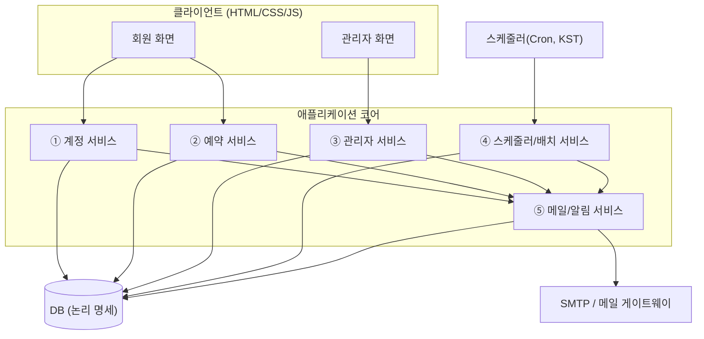
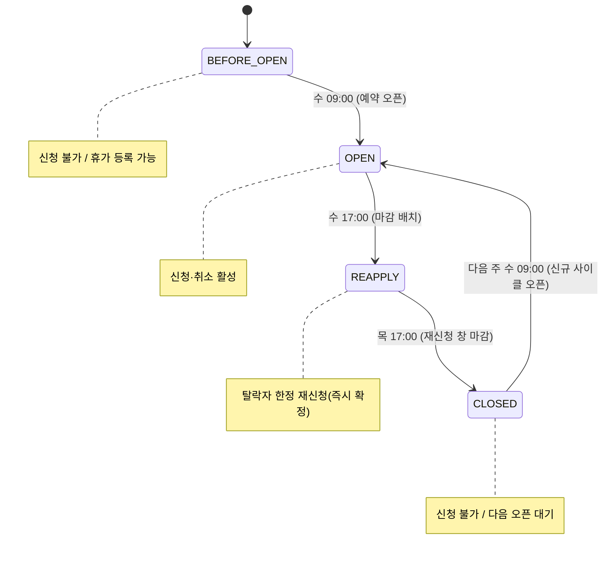
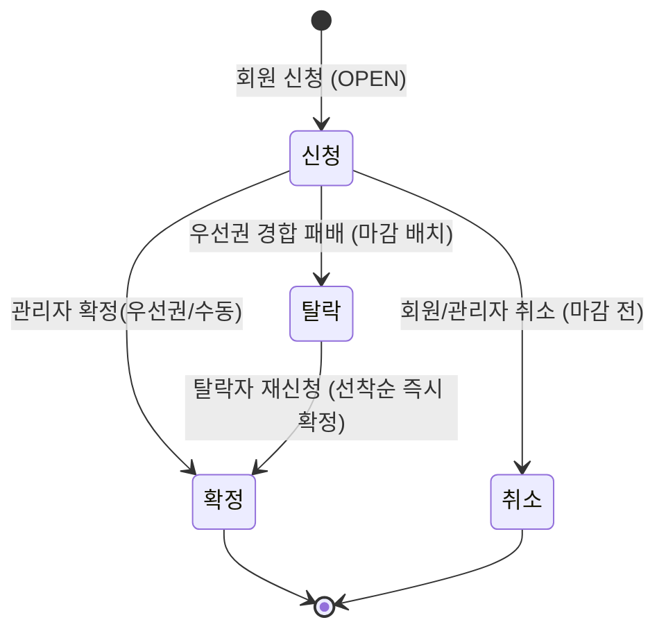

# 헬스키퍼 예약 시스템 — 시스템 설계 개요 (Overview)

> 본 문서는 `docs/guide/detail/상세 설계서 초안.md` 및 `docs/guide/preview/설계서 초안.md`를 기반으로
> 시스템을 **서비스 > 페이지 > 액션** 단위로 재정리한 **시스템 설계서**의 최상위 개요 문서이다.
> 개별 서비스의 상세 비즈니스 로직, DB 논리 명세, 개발 스펙은 아래 [문서 인덱스](#7-문서-인덱스)를 참고한다.

- 서비스명: **아이뱅크 안마서비스(헬스키퍼) 예약 시스템**
- 문서 버전: v1.0 (시스템 설계 초안)
- 시간 기준: **KST(Asia/Seoul)** 단일 적용

---

## 1. 문서의 목적과 범위

### 1.1 목적
- 안마사 1인의 한정된 시간을 **공정한 우선권 규칙**으로 배분하는 주 단위 예약 시스템의 설계를 확정한다.
- 화면(와이어프레임/퍼블리싱) 및 백엔드 구현이 동일한 비즈니스 규칙을 공유하도록 **액션 단위로 로직을 명세**한다.
- DB 논리 모델과 개발 스펙(API/동시성/보안)을 제공하여 구현 단계로 바로 진입할 수 있게 한다.

### 1.2 범위
- 회원(사용자) 예약 플로우 전체, 관리자 운영 플로우 전체, 마감/오픈 자동 배치, 메일 발송.
- 본 문서군은 **논리 설계**까지를 다룬다. 물리 DB 튜닝, 인프라 토폴로지, 상세 UI 시안은 후속 단계로 위임한다.

### 1.3 설계 표기 규칙
- **서비스**: 동일한 책임을 가진 기능 묶음(배포/소유 단위 후보).
- **페이지**: 서비스 내 사용자/관리자 화면. UI가 없는 서비스는 **잡(Job)**으로 표기.
- **액션**: 페이지에서 일어나는 단일 사용자 행위 또는 시스템 처리. 모든 액션은 아래 공통 템플릿으로 기술한다.

```
[액션 ID] 액션명
- 트리거      : 버튼/이벤트/스케줄
- 전제조건    : 인증/권한/시스템 상태/데이터 조건
- 입력        : 파라미터
- 처리 로직   : 1) ... 2) ... (검증 → 상태확인 → 영속화 → 부수효과 순)
- 결과/후처리 : 응답, 상태 전이, 메일/이용일 갱신 등 사이드이펙트
- 예외        : 실패 케이스와 사용자 메시지
- 관련 데이터 : 접근/변경 엔티티
```

---

## 2. 서비스 아키텍처

### 2.1 서비스 분해
시스템을 5개 서비스로 분해한다. 사용자/관리자 서비스는 **페이지 > 액션**, 백엔드 자동화 서비스는 **잡 > 액션** 구조를 가진다.

| # | 서비스 | 책임 | UI | 상세 문서 |
|---|--------|------|----|-----------|
| 1 | **계정 서비스** | 회원가입, 이메일 인증, 로그인/로그아웃, 내 정보/탈퇴 | 회원 화면 | [01-계정-서비스.md](./01-계정-서비스.md) |
| 2 | **예약 서비스** | 홈/상태배너, 예약 캘린더(신청/취소), 탈락자 재신청, 내 예약 내역 | 회원 화면 | [02-예약-서비스.md](./02-예약-서비스.md) |
| 3 | **관리자 서비스** | 관리자 로그인, 대시보드, 예약 관리(목록/상세/확정/안내메일), 휴가, 운영 설정 | 관리자 화면 | [03-관리자-서비스.md](./03-관리자-서비스.md) |
| 4 | **스케줄러/배치 서비스** | 예약 오픈, 마감 배치(우선권 정렬·탈락), 재신청 창 오픈/마감, 메일 재시도 | 무(無) UI / 잡 | [04-스케줄러-배치-서비스.md](./04-스케줄러-배치-서비스.md) |
| 5 | **메일/알림 서비스** | 메일 생성·발송, 재시도 큐, 발송 상태, 템플릿 | 무(無) UI(설정은 관리자) | [05-메일-알림-서비스.md](./05-메일-알림-서비스.md) |

### 2.2 컨텍스트 다이어그램



### 2.3 서비스 간 핵심 상호작용
- **예약 서비스 → 메일/알림 서비스**: 재신청 즉시 확정 시 완료 메일 요청.
- **관리자 서비스 → 메일/알림 서비스**: 일반 확정 시 완료 메일, 탈락자 재신청 안내 메일 요청.
- **스케줄러/배치 서비스 → (예약·메일)**: 마감 시 우선권 정렬/탈락 처리 후 안내 메일 일괄 요청, 시스템 상태 전이.
- **전 서비스 → 운영 설정**: 운영 시간/오픈·마감 시각/메일 템플릿은 운영 설정에서 읽는다.

---

## 3. 액터(Actor)

| 액터 | 정의 | 주요 권한 |
|------|------|-----------|
| 비회원 | 가입 전 방문자 | 서비스 소개 열람, 회원가입, 로그인 |
| 회원(신청자) | 이메일 인증 완료 사용자 | 차주 슬롯 조회, 신청/취소, 내 내역 조회, (탈락 시) 재신청 |
| 관리자 | 서비스 운영자 | 신청 현황/우선권 확인, 확정/탈락 처리, 휴가/운영 설정, 메일 발송 |
| 시스템(스케줄러) | 시각 기반 자동 처리 주체 | 오픈/마감/재신청 창 전환, 우선권 정렬, 자동 메일 |

---

## 4. 핵심 도메인 개념

### 4.1 용어
| 용어 | 정의 |
|------|------|
| 사이클(Cycle) | 한 주의 예약 운영 단위. 오픈~마감~재신청~종료의 1회전 |
| 슬롯(Slot) | 예약 단위 시간. 차주 월~금 × 4타임 = 주당 최대 **20슬롯** |
| 신청(Reservation) | 회원이 슬롯을 선택해 접수한 건. 상태를 가진다 |
| 우선권(Priority) | 동일 슬롯 경합 시 배분 기준. (마지막 이용일 오래된 순 → 동률 시 신청 시각 빠른 순) |
| 마지막 이용일 | 회원이 마지막으로 안마서비스를 받은(확정 기준) 날짜. **확정 시에만 갱신** |
| 재신청 창 | 마감 직후(수 17:00) ~ 다음날(목) 17:00. 탈락자 한정 선착순 즉시 확정 |

### 4.2 운영 시간 슬롯 (기본값)
| 타임 | 시간 |
|------|------|
| 1타임 | 13:30 ~ 14:00 |
| 2타임 | 14:30 ~ 15:00 |
| 3타임 | 15:30 ~ 16:00 |
| 4타임 | 16:30 ~ 17:00 |

> 운영 시간/슬롯 구성, 오픈·마감 시각은 **운영 설정(B-9)** 으로 변경 가능한 정책값이다. 본 문서의 시각은 기본값이다.

### 4.3 슬롯 점유 규칙
- 안마사 **1명** → 각 슬롯은 **확정 1건만** 가능(DB 유니크 제약).
- 동일 슬롯에 **여러 회원의 `신청`은 허용**(중복 신청). 확정은 마감 시 우선권 또는 관리자 처리, 재신청 창에서는 선착순으로 결정.
- 동일 회원이 **동일 슬롯에 중복 신청 불가**.

---

## 5. 상태 머신

### 5.1 시스템 상태(System State) — 주간 사이클
회원 화면의 신청 가능 여부를 결정하는 전역 시간 기반 상태. 상태 전이는 **스케줄러**가 수행한다([04 문서](./04-스케줄러-배치-서비스.md) 참조).



| 상태 코드 | 기간 | 회원 화면 동작 | 휴가 등록 |
|-----------|------|----------------|-----------|
| BEFORE_OPEN | 수 09:00 이전 | "예약 오픈 전", 신청 불가 | 가능 |
| OPEN | 수 09:00 ~ 16:59 | 신청·취소 활성 | 차단 |
| REAPPLY | 수 17:00 ~ 목 17:00 | 탈락자 한정 재신청 | 차단 |
| CLOSED | 목 17:00 ~ 다음 수 09:00 | "예약 마감", 신청 불가 | (다음 사이클 대상) |

> `CLOSED`는 직전 사이클 종료이자 다음 사이클의 "오픈 전 대기"와 동일한 역할을 한다. `BEFORE_OPEN`은 최초 부트스트랩/첫 사이클의 동등 상태로 본다.

### 5.2 예약 상태(Reservation Status)



| 상태 | 설명 | 전이 |
|------|------|------|
| 신청(요청) | 일반 신청 접수, 확정 대기 | → 확정 / 탈락 / 취소 |
| 확정(완료) | 최종 확정(완료 메일 발송). **마지막 이용일 갱신** | (종료) 재신청 확정은 취소 불가 |
| 탈락 | 우선권 밀림(재신청 안내 대상) | → (재신청 시) 확정 |
| 취소 | 마감 전 취소. 우선권 영향 없음 | (종료) |

### 5.3 상태 일관성 불변식(Invariants)
- I-1. 한 슬롯은 동시에 둘 이상의 `확정`을 가질 수 없다. (슬롯 단위 유니크)
- I-2. `확정` 전이 시에만 회원 `마지막 이용일`이 갱신된다. (`취소`/`탈락`은 불변)
- I-3. 재신청에 의한 `확정`은 **취소 불가**. 상태 역전(확정 → 취소)이 발생하지 않는다.
- I-4. 마감(수 17:00) 이후 `신청 → 취소` 전이는 어떤 경로로도 불가능하다.
- I-5. 동일 회원·동일 슬롯에 활성 신청(취소 제외)은 1건만 존재한다.

---

## 6. 주간 운영 타임라인 & 라이프사이클(요약)

```
[오픈 전]      관리자: 차주 휴가 사전 등록 (BEFORE_OPEN)
   │
[수 09:00]     예약 오픈 → OPEN  (이후 휴가 등록 차단)
   │
[수 09:00~16:59] 회원: 신청 / 마감 전 취소 (중복 신청 허용, 취소는 우선권 무영향)
   │
[수 17:00]     마감 배치 → REAPPLY
   │           · 슬롯별 우선권 정렬(마지막 이용일 → 신청 시각)
   │           · 1순위 외 탈락 처리, 단독 신청은 확정 대상 분류
   │           · 탈락자에게 빈 슬롯 포함 재신청 안내 메일
   │           · (정책) 일반 확정은 관리자 확정(B-5) 또는 자동 확정
   │
[수17:00~목17:00] 탈락자: 빈 슬롯 선착순 재신청 → 즉시 확정(취소 불가) + 완료 메일
   │
[목 17:00]     재신청 창 마감 → CLOSED (모든 신청 종료)
   │
[다음 주 수 09:00] 신규 사이클 오픈
```

- 단계별 상세 상태 전이표와 분기 로직은 [04-스케줄러-배치-서비스.md](./04-스케줄러-배치-서비스.md)를 참조한다.

---

## 7. 문서 인덱스

| 순서 | 문서 | 내용 |
|------|------|------|
| 00 | **본 문서** | 개요, 서비스 아키텍처, 도메인/상태 머신, 공통 정책 |
| 01 | [계정 서비스](./01-계정-서비스.md) | 회원가입 · 이메일 인증 · 로그인 · 내 정보(페이지>액션) |
| 02 | [예약 서비스](./02-예약-서비스.md) | 홈 · 예약 캘린더 · 재신청 · 내 예약 내역(페이지>액션) |
| 03 | [관리자 서비스](./03-관리자-서비스.md) | 대시보드 · 예약 관리 · 확정 · 휴가 · 설정(페이지>액션) |
| 04 | [스케줄러/배치 서비스](./04-스케줄러-배치-서비스.md) | 오픈/마감/재신청 창 잡, 우선권·탈락 처리(잡>액션) |
| 05 | [메일/알림 서비스](./05-메일-알림-서비스.md) | 메일 종류·발송·재시도 큐·템플릿 |
| 06 | [DB 논리 명세](./06-DB-논리-명세.md) | ERD, 엔티티·제약·인덱스, 우선권 쿼리 |
| 07 | [개발 스펙](./07-개발-스펙.md) | 아키텍처·API 명세·동시성·보안·비기능 요구사항 |

---

## 8. 공통 정책 & 횡단 관심사

| 구분 | 정책 |
|------|------|
| 시간 기준 | 모든 시각은 KST(Asia/Seoul) 단일 적용. 저장은 UTC + 표시 변환 권장 |
| 동시성 | 재신청 즉시 확정 등 경합 지점은 **슬롯 단위 락 + 유니크 제약**으로 직렬화 |
| 멱등성 | 배치/메일 처리는 재실행 가능하도록 멱등 설계 (처리 여부 플래그/유니크 키) |
| 메일 | 발송 실패는 **재시도 큐** 적재, 관리자 대시보드에 상태 표시 및 수동 재발송 |
| 우선권 | 마지막 이용일 오래된 순 → 동률 시 신청 시각 빠른 순. 전원/상위 이력 없음은 관리자 수동 확정 |
| 취소 영향 | 회원 취소는 마지막 이용일/우선권에 영향 없음 |
| 노쇼 | 확정 후 노쇼 별도 처리 없음(현 정책) |

---

## 9. 설계 가정 및 확인 필요 사항(Assumptions)

> 초안에서 "예시"로 명시되었거나 본 설계에서 보강한 항목. 운영 정책 확정 시 갱신한다.

| ID | 항목 | 본 설계의 가정 | 근거/대안 |
|----|------|----------------|-----------|
| AS-1 | 일반 확정 방식 | 마감 시 자동 탈락 처리 + 일반 슬롯은 **관리자 확정(B-5)** | 초안 B-7.3 단서. 운영 설정으로 "자동 확정" 전환 가능 |
| AS-2 | 마지막 이용일 값 | 확정된 슬롯의 **서비스 날짜(slot_date)** 로 갱신(최신값 유지) | "확정 완료 기준" 해석. 실제 시술 완료 트리거 없음(노쇼 미처리) |
| AS-3 | 이력 없음 동률 | 상위 후보가 이력 없음으로 유일 결정 불가 시 **관리자 수동 확정 플래그** | 초안 B-4.3 / F-5 |
| AS-4 | 관리자 계정 | 회원과 분리된 관리자 계정 테이블 운용(통합도 가능) | 분리 로그인 페이지 존재 |
| AS-5 | 비밀번호/토큰 정책 | 토큰 24h, 비밀번호 영문+숫자+특수 조합 | 초안 예시값. 운영 정책으로 조정 |
| AS-6 | 프론트엔드 | React 미사용, **HTML/CSS/Vanilla JS** + 디자인 토큰(Calendly 레퍼런스) | 프로젝트 규칙 |

---

> 다음 문서: [01-계정-서비스.md](./01-계정-서비스.md)
