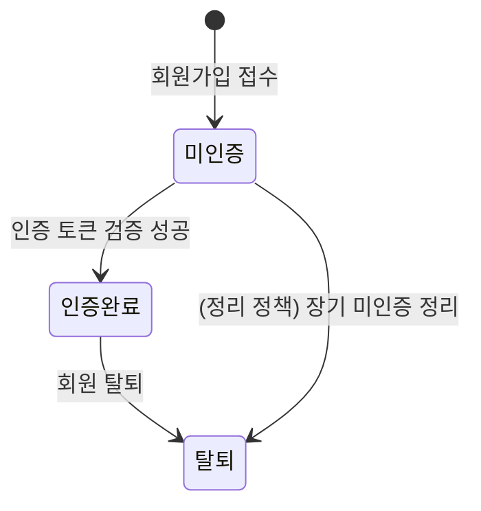

# 01. 계정 서비스 (Account Service)

> 상위 문서: [00-개요.md](./00-개요.md) · 다음 문서: [02-예약-서비스.md](./02-예약-서비스.md)
> 데이터 정의: [06-DB-논리-명세.md](./06-DB-논리-명세.md) · API: [07-개발-스펙.md](./07-개발-스펙.md)

## 서비스 개요

| 항목 | 내용 |
|------|------|
| 책임 | 회원 가입·이메일 인증·로그인/로그아웃·내 정보 관리·탈퇴 |
| 주요 액터 | 비회원, 회원 |
| 핵심 엔티티 | `member`, `email_verification_token`, (옵션) `login_attempt` |
| 의존 서비스 | 메일/알림 서비스(인증 메일 발송) |
| 핵심 불변식 | 이메일 유일성, `미인증` 계정 로그인 차단, 토큰 1회성 |

### 회원 계정 상태(member.status)

| 상태 | 의미 | 로그인 |
|------|------|--------|
| 미인증(PENDING) | 가입 접수, 이메일 미인증 | 차단(안내+재발송) |
| 인증완료(ACTIVE) | 정상 회원 | 허용 |
| 탈퇴(WITHDRAWN) | 탈퇴 처리됨 | 차단 |

### 페이지 맵
| 페이지 | 경로(예시) | 접근 권한 | 주요 액션 |
|--------|-----------|-----------|-----------|
| P1 회원가입 | `/signup` | 비회원 | 이메일 중복 검사, 가입 제출 |
| P2 이메일 인증 | `/verify?token=...` | 미인증 회원 | 토큰 검증, 인증 메일 재발송 |
| P3 로그인 | `/login` | 비회원 | 로그인, 미인증 안내, 로그아웃 |
| P4 내 정보 관리 | `/mypage/profile` | 회원 | 정보 조회, 비밀번호 변경, 탈퇴 |

---

## P1. 회원가입 (`/signup`)

### 입력 항목
| 항목 | 필수 | 유효성 |
|------|------|--------|
| 이름 | Y | 1~50자 |
| 이메일 | Y | RFC 이메일 형식, 전역 중복 불가 |
| 비밀번호 | Y | 영문+숫자+특수문자 조합, 최소 길이 정책(예: 8자) |
| 비밀번호 확인 | Y | 비밀번호와 일치 |

### [ACC-P1-A1] 이메일 중복 실시간 검사
- 트리거: 이메일 입력 blur 또는 [중복확인] 클릭
- 전제조건: 없음(비회원)
- 입력: `email`
- 처리 로직:
  1. 이메일 형식 검증(서버). 형식 불일치 시 즉시 반환.
  2. `member` 에서 `email` 일치 + `status != 탈퇴` 존재 여부 조회.
  3. 존재하면 `duplicated=true`, 없으면 `false` 반환.
- 결과/후처리: 가용/중복 여부를 폼에 표시. (확정 판단은 제출 시 재검증)
- 예외: 형식 오류 → "올바른 이메일 형식이 아닙니다."
- 관련 데이터: `member`(read)

### [ACC-P1-A2] 회원가입 제출
- 트리거: [가입] 버튼
- 전제조건: 비로그인 상태
- 입력: `name, email, password, passwordConfirm`
- 처리 로직:
  1. **클라이언트+서버 이중 검증**: 필수값/형식/비밀번호 규칙/비밀번호 일치.
  2. 이메일 **중복 재검사**(트랜잭션 내, 유니크 제약과 병행). 중복 시 거절.
  3. 비밀번호 해시 생성(단방향, 솔트).
  4. `member` insert: `status=미인증`, `last_used_date=NULL`, `created_at=now`.
  5. **인증 토큰 발급**: 난수 토큰 생성, `email_verification_token` insert(`expires_at=now+24h`, `used_at=NULL`).
  6. 메일/알림 서비스에 **인증 메일 발송 요청**(토큰 링크 포함).
- 결과/후처리: "인증 메일을 발송했습니다. 메일을 확인해주세요." 안내. 로그인 페이지로 유도.
- 예외:
  - 중복 이메일 → "이미 가입된 이메일입니다." (가입 중단)
  - 비밀번호 불일치 → "비밀번호가 일치하지 않습니다." (제출 차단)
  - 비밀번호 규칙 위반 → "비밀번호는 영문/숫자/특수문자를 포함해야 합니다."
- 관련 데이터: `member`(insert), `email_verification_token`(insert), 메일 큐(enqueue)

> 보안 옵션: 이메일 존재 여부 노출을 최소화하려면 제출 응답을 항상 "메일 발송" 메시지로 통일하고, 중복 시 별도 안내 메일을 보내는 방식도 고려한다(AS, 운영 결정).

---

## P2. 이메일 인증 (`/verify?token=...`)

### [ACC-P2-A1] 인증 토큰 검증
- 트리거: 메일 내 인증 링크 클릭(페이지 진입)
- 전제조건: 토큰 파라미터 존재
- 입력: `token`
- 처리 로직:
  1. 토큰으로 `email_verification_token` 조회. 미존재/위변조 → 실패.
  2. `used_at IS NOT NULL` → 이미 사용 → 실패(또는 "이미 인증됨" 안내).
  3. `expires_at < now` → 만료 → 실패(재발송 유도).
  4. 유효 시 **트랜잭션**: 대상 `member.status = 인증완료`, `token.used_at = now`(1회성 소멸).
- 결과/후처리: "인증이 완료되었습니다. 로그인해주세요." → 로그인 이동.
- 예외:
  - 만료 → "인증 링크가 만료되었습니다." + [인증 메일 재발송] 노출
  - 무효/사용됨 → "유효하지 않은 인증 링크입니다."
- 관련 데이터: `member`(update status), `email_verification_token`(update used_at)

### [ACC-P2-A2] 인증 메일 재발송
- 트리거: [인증 메일 재발송] 버튼(만료/오류 화면 또는 로그인 미인증 안내)
- 전제조건: 대상 계정이 `미인증` 상태
- 입력: `email`(또는 만료 토큰으로 식별)
- 처리 로직:
  1. 대상 `member` 조회 및 `미인증` 확인. (`인증완료`면 "이미 인증됨" 안내)
  2. **발송 쿨다운** 확인(예: 최근 N분 내 재발송 제한) → 초과 시 대기 안내.
  3. 기존 미사용 토큰 무효화(선택) 후 **신규 토큰 발급**(`expires_at=now+24h`).
  4. 메일/알림 서비스에 인증 메일 발송 요청.
- 결과/후처리: "인증 메일을 재발송했습니다."
- 예외: 쿨다운 위반 → "잠시 후 다시 시도해주세요."; 이미 인증 → 로그인 유도
- 관련 데이터: `email_verification_token`(insert/update), 메일 큐(enqueue)

---

## P3. 로그인 / 로그아웃 (`/login`)

### [ACC-P3-A1] 로그인
- 트리거: [로그인] 버튼
- 전제조건: 비로그인
- 입력: `email, password`
- 처리 로직:
  1. `member` 를 `email`로 조회. 없으면 인증 실패 처리(메시지 일반화).
  2. 계정 상태 확인:
     - `미인증` → 미인증 안내 분기([ACC-P3-A2]).
     - `탈퇴` → 로그인 불가 안내.
  3. (옵션) **로그인 실패 횟수/잠금** 확인: 잠금 임계 초과 시 차단.
  4. 비밀번호 해시 비교. 불일치 → 실패 카운트 증가 후 거절.
  5. 일치 시 세션/토큰 발급, 실패 카운트 초기화, `last_login_at` 갱신.
- 결과/후처리: 예약 캘린더(`/reservation`)로 이동.
- 예외:
  - 자격 불일치 → "이메일 또는 비밀번호가 올바르지 않습니다." (계정 존재 여부 비노출)
  - 잠금 → "로그인 시도가 많아 잠시 후 다시 시도해주세요."
- 관련 데이터: `member`(read/update), (옵션)`login_attempt`

### [ACC-P3-A2] 미인증 계정 로그인 안내
- 트리거: [ACC-P3-A1]에서 `미인증` 분기
- 처리 로직: 로그인 거절 + "이메일 인증 후 이용 가능합니다." 안내, [인증 메일 재발송] 제공([ACC-P2-A2] 연계).
- 관련 데이터: `member`(read)

### [ACC-P3-A3] 로그아웃
- 트리거: [로그아웃]
- 전제조건: 로그인 상태
- 처리 로직: 세션/토큰 무효화.
- 결과/후처리: 홈으로 이동.

---

## P4. 내 정보 관리 (`/mypage/profile`)

### [ACC-P4-A1] 내 정보 조회
- 트리거: 페이지 진입
- 전제조건: 로그인(인증완료)
- 처리 로직: 본인 `member`의 이름·이메일·가입일·마지막 이용일(참고) 조회.
- 결과/후처리: 정보 표시. (이메일 변경 정책은 별도)
- 관련 데이터: `member`(read)

### [ACC-P4-A2] 비밀번호 변경
- 트리거: [변경] 버튼
- 전제조건: 로그인
- 입력: `currentPassword, newPassword, newPasswordConfirm`
- 처리 로직:
  1. 현재 비밀번호 해시 비교. 불일치 → 거절.
  2. 신규 비밀번호 규칙 검증 + 확인 일치 검증.
  3. (옵션) 직전 비밀번호와 동일 여부 차단.
  4. 새 해시 저장, (옵션) 기존 세션 무효화/재로그인 유도.
- 결과/후처리: "비밀번호가 변경되었습니다."
- 예외: 현재 비밀번호 불일치 → "현재 비밀번호가 올바르지 않습니다."
- 관련 데이터: `member`(update)

### [ACC-P4-A3] 회원 탈퇴
- 트리거: [회원 탈퇴]
- 전제조건: 로그인
- 처리 로직:
  1. **진행 중 예약 점검**: 미래 `확정`/`신청` 건 존재 시 안내(취소/유지 정책 고지).
  2. 확인 절차(비밀번호 재확인 권장) 후 `member.status = 탈퇴` 처리(소프트 삭제 권장).
  3. 개인정보 처리방침에 따른 데이터 보존/마스킹 정책 적용.
  4. 세션 무효화.
- 결과/후처리: "탈퇴가 완료되었습니다."
- 예외: 진행 중 신청 존재 → 안내 후 사용자 확인 필요
- 관련 데이터: `member`(update), 연계 `reservation`(조회/정책 처리)

---

## 검증 규칙 요약

| 액션 | 검증 | 실패 처리 |
|------|------|-----------|
| 가입 | 이메일 형식·중복, 비밀번호 규칙·일치 | 거절 + 안내 |
| 인증 | 토큰 유효/만료/1회성 | 재발송 유도 |
| 로그인 | 인증완료 상태, 자격 일치, (옵션)잠금 | 일반화 메시지 |
| 비번 변경 | 현재 비번 일치, 규칙·확인 | 거절 |
| 탈퇴 | 진행 중 예약 확인 | 안내 후 진행 |

## 메일 트리거 요약
| 시점 | 메일 | 참조 |
|------|------|------|
| 가입 직후 | 이메일 인증 메일(토큰 24h) | [05 메일 서비스](./05-메일-알림-서비스.md) |
| 재발송 요청 | 이메일 인증 메일(신규 토큰) | 동일 |
