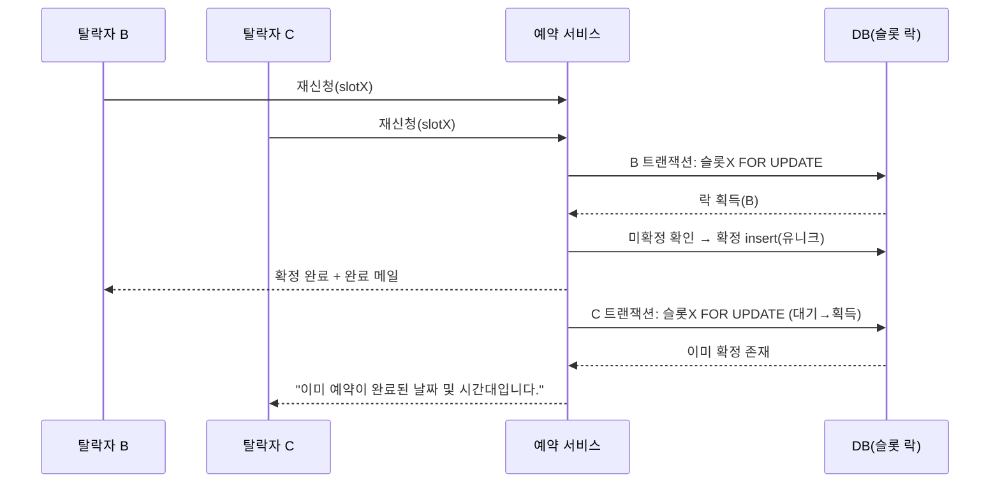

# 02. 예약 서비스 (Reservation Service)

> 상위 문서: [00-개요.md](./00-개요.md) · 이전: [01-계정-서비스.md](./01-계정-서비스.md) · 다음: [03-관리자-서비스.md](./03-관리자-서비스.md)
> 데이터 정의: [06-DB-논리-명세.md](./06-DB-논리-명세.md) · 자동 처리: [04-스케줄러-배치-서비스.md](./04-스케줄러-배치-서비스.md)

## 서비스 개요

| 항목 | 내용 |
|------|------|
| 책임 | 차주 슬롯 조회, 예약 신청/취소, 탈락자 재신청(즉시 확정), 내 예약 내역 |
| 주요 액터 | 비회원(홈), 회원 |
| 핵심 엔티티 | `reservation_cycle`, `slot`, `vacation`, `reservation`, `member` |
| 의존 | 운영 설정(시각/슬롯), 시스템 상태(스케줄러), 메일/알림(재신청 완료 메일) |
| 핵심 불변식 | I-1(슬롯당 확정 1), I-4(마감 후 취소 불가), I-5(동일 회원 동일 슬롯 1건) |

### 시스템 상태 의존성
모든 신청/취소/재신청 액션은 **현재 시스템 상태(System State)** 에 강하게 의존한다. 상태 정의는 [00 개요 §5.1](./00-개요.md#51-시스템-상태system-state--주간-사이클) 참조.

| 상태 | 신청 | 취소 | 재신청 |
|------|------|------|--------|
| BEFORE_OPEN | ✕ | ✕ | ✕ |
| OPEN | ○ | ○(마감 전) | ✕ |
| REAPPLY | ✕ | ✕ | ○(탈락자) |
| CLOSED | ✕ | ✕ | ✕ |

### 페이지 맵
| 페이지 | 경로(예시) | 접근 권한 | 주요 액션 |
|--------|-----------|-----------|-----------|
| P1 홈/서비스 소개 | `/` | 전체 | 상태 배너 조회, CTA 분기 |
| P2 예약 캘린더 | `/reservation` | 회원 | 차주 조회, 슬롯 신청, 신청 취소, 재신청 진입 |
| P3 탈락자 재신청 | `/reservation/reapply` | 회원(탈락자) | 빈 슬롯 조회, 재신청 제출(즉시 확정) |
| P4 내 예약 내역 | `/mypage/reservations` | 회원 | 내역 조회, 마감 전 취소 |

---

## P1. 홈 / 서비스 소개 (`/`)

### [RSV-P1-A1] 현재 상태 배너 조회
- 트리거: 페이지 진입
- 전제조건: 없음(비회원 포함)
- 처리 로직:
  1. 현재 KST 시각 기준 **시스템 상태** 산출(`reservation_cycle.state` 또는 시각 파생).
  2. 상태별 안내 문구/다음 오픈 시각 계산.
- 결과/후처리: 상태 배너 노출.
- 상태별 문구(예시):
  | 상태 | 문구 |
  |------|------|
  | BEFORE_OPEN | "이번 주 예약은 수요일 09:00에 오픈됩니다." |
  | OPEN | "차주 예약 신청이 가능합니다. (오늘 17:00 마감)" |
  | REAPPLY | "탈락자 재신청 기간입니다. (내일 17:00까지)" |
  | CLOSED | "현재 예약 접수 기간이 아닙니다. 다음 오픈: 수요일 09:00" |
- 관련 데이터: `reservation_cycle`(read)

### [RSV-P1-A2] CTA 분기
- 트리거: 페이지 진입(렌더)
- 처리 로직: 로그인 상태 분기 — 비회원 [회원가입]/[로그인], 회원 [예약하기].
- 관련 데이터: 세션

---

## P2. 예약 캘린더 (`/reservation`) — 핵심 페이지

### 화면 구성
| 영역 | 설명 |
|------|------|
| 상태 배너 | OPEN/REAPPLY/CLOSED 등 현재 상태 안내 |
| 주간 그리드 | 차주 월~금 × 4타임(20셀) |
| 슬롯 셀 | 상태별 [신청]/[취소]/비활성 |
| 정책 안내 | "신청 ≠ 확정" 명확 고지 |

### 슬롯 표시 규칙
| 표시 | 조건 | 동작 |
|------|------|------|
| 신청 가능 | OPEN & 비휴가 & 내 미신청 & 미확정 | [신청] 활성 |
| 내 신청됨 | 내 활성 `신청` 존재 | [취소] 활성(마감 전) |
| 경합 표시 | 동일 슬롯 타 회원 `신청` 존재 | 중복 신청 가능 + 우선권 경합 안내 |
| 확정됨 | 슬롯에 `확정` 존재 | 신청 불가 표시 |
| 휴가 | 해당 날짜 휴가 | 비활성("안마사 휴무일") |
| 오픈전/마감 | BEFORE_OPEN/CLOSED | 전체 비활성 |

### [RSV-P2-A1] 차주 일정 조회
- 트리거: 페이지 진입
- 전제조건: 로그인(인증완료)
- 처리 로직:
  1. 현재 시스템 상태/활성 `reservation_cycle` 식별 → 대상 주(월~금) 산출.
  2. 해당 사이클의 `slot` 20건 조회 + `vacation` 반영.
  3. 각 슬롯의 신청 현황 집계(타인 신청 수, 확정 여부, 내 신청 여부).
  4. 표시 규칙에 따라 셀 상태 계산.
- 결과/후처리: 주간 그리드 렌더. CLOSED/BEFORE_OPEN은 안내만 노출.
- 예외: 활성 사이클 없음(부트스트랩) → "현재 예약 일정이 없습니다."
- 관련 데이터: `reservation_cycle`, `slot`, `vacation`, `reservation`(read)

### [RSV-P2-A2] 슬롯 신청
- 트리거: 슬롯 셀 [신청]
- 전제조건: 로그인, **시스템 상태 = OPEN**
- 입력: `slotId`
- 처리 로직:
  1. 시스템 상태 = OPEN 재검증(서버 신뢰). 아니면 거절.
  2. 슬롯 유효성: 활성 사이클 소속 + **비휴가** + **미확정**.
  3. **본인 중복 검사**: 동일 슬롯 본인 활성 신청(취소 제외) 존재 시 거절(I-5).
  4. (경합 안내) 동일 슬롯 타인 신청 존재 시, 클라이언트에 우선권 경합 고지 후 진행.
  5. `reservation` insert: `type=일반`, `status=신청`, `applied_at=now`.
- 결과/후처리: "신청이 접수되었습니다. (관리자 확정 후 예약이 완료됩니다.)" — **확정 아님**을 명시.
- 예외:
  - 비OPEN → "현재 예약 신청 기간이 아닙니다."
  - 휴가 슬롯 → "안마사 휴무일입니다."
  - 본인 중복 → "이미 신청한 시간입니다."
  - 확정된 슬롯 → "이미 예약이 마감된 시간입니다."
- 관련 데이터: `reservation`(insert), `slot`/`vacation`(read)
- 동시성: 신청은 중복 허용이므로 강한 락 불필요. 단 본인 중복 차단은 `(slot_id, member_id) where status<>취소` 부분 유니크로 방어.

### [RSV-P2-A3] 신청 취소 (마감 전)
- 트리거: 슬롯 셀/내역 [취소]
- 전제조건: 로그인, **시스템 상태 = OPEN(마감 전)**, 본인 `신청` 건
- 입력: `reservationId`
- 처리 로직:
  1. 대상 신청 본인 소유 + 상태 `신청` 확인.
  2. **마감 전(OPEN)** 여부 확인. 마감 후면 거절(I-4).
  3. `reservation.status = 취소`, `cancelled_at=now`.
- 결과/후처리: "신청이 취소되었습니다." — **마지막 이용일 불변, 우선권 영향 없음**(I-2).
- 예외:
  - 마감 후(REAPPLY/CLOSED) → "마감 이후에는 취소할 수 없습니다."
  - 재신청 확정 건 → "재신청 건은 취소할 수 없습니다." (I-3)
- 관련 데이터: `reservation`(update)

### [RSV-P2-A4] 재신청 화면 진입
- 트리거: 재신청 안내/버튼
- 전제조건: **시스템 상태 = REAPPLY** & 해당 주차 **탈락자**
- 처리 로직: 접근 제어 검증 후 P3로 라우팅.
- 예외:
  - 비탈락자 → "재신청 대상이 아닙니다."
  - 창 시간 외 → "재신청 기간이 아닙니다."
- 관련 데이터: `reservation`(read, 본인 탈락 존재)

### 시나리오(요약)
- **단독 신청**: OPEN에 빈 슬롯 신청 → `신청` 접수 → 마감 시 확정 대상 분류.
- **중복 신청**: 타인 신청 슬롯 신청 → 경합 안내 후 `신청` → 마감 시 우선권으로 확정/탈락.
- **마감 후 취소 시도**: 거절(I-4). **휴가 슬롯 신청**: 차단.

---

## P3. 탈락자 재신청 (`/reservation/reapply`) — 선착순·즉시 확정·취소 불가

### 접근 제어
| 조건 | 결과 |
|------|------|
| 비탈락자 | "재신청 대상이 아닙니다." → 차단 |
| 창 시간 외(비REAPPLY) | "재신청 기간이 아닙니다." → 차단 |
| 탈락자 & REAPPLY | 재신청 화면 노출 |

### [RSV-P3-A1] 빈 슬롯 조회
- 트리거: 페이지 진입/새로고침
- 전제조건: REAPPLY & 탈락자
- 처리 로직:
  1. 활성 사이클의 슬롯 중 **확정 없음 & 비휴가** 슬롯 조회(실시간).
  2. 본인 이미 확정 보유 슬롯 제외(선택 정책).
- 결과/후처리: 빈 슬롯 목록 노출(실시간 갱신 권장).
- 관련 데이터: `slot`, `reservation`(확정 여부), `vacation`(read)

### [RSV-P3-A2] 재신청 제출 (즉시 확정)
- 트리거: 빈 슬롯 [재신청]
- 전제조건: REAPPLY & 탈락자 & 대상 슬롯 미확정
- 입력: `slotId`
- 처리 로직(**동시성 임계구역**):
  1. 시스템 상태 = REAPPLY 재검증.
  2. 본인 탈락 자격(해당 주차 `탈락` 보유) 재검증.
  3. **슬롯 단위 락 획득**(`SELECT ... FOR UPDATE` 또는 슬롯 확정 유니크 제약).
  4. 락 내에서 슬롯 **미확정 재확인**. 이미 확정 → 거절.
  5. 신규/기존 신청을 `확정(완료)` 처리: `type=재신청`, `confirmed_at=now`, `confirmed_by=재신청`.
     - 슬롯의 확정 참조 설정(유니크 제약으로 1건 보장).
  6. **회원 마지막 이용일 갱신**(`last_used_date = slot_date`, 최신값 유지) (I-2).
  7. 메일/알림 서비스에 **완료 메일(재신청)** 발송 요청.
- 결과/후처리: "예약이 확정되었습니다. (재신청 건은 취소할 수 없습니다.)"
- 예외:
  - 이미 확정(경합 패배) → "이미 예약이 완료된 날짜 및 시간대입니다." → 다른 슬롯 재시도 유도
  - 비REAPPLY → "재신청 기간이 아닙니다."
  - 비탈락자 → "재신청 대상이 아닙니다."
- 관련 데이터: `reservation`(insert/update→확정), `slot`(확정 참조), `member`(이용일), 메일 큐
- **취소 버튼 미노출**(I-3).

### 동시성 시퀀스(동시 클릭)

---

## P4. 내 예약 내역 (`/mypage/reservations`)

### 상태별 노출
| 상태 | 노출 라벨 | 취소 버튼 |
|------|-----------|-----------|
| 신청 | "확정 대기" | 마감 전 활성 |
| 확정(일반) | "예약 확정" | 비활성 |
| 확정(재신청) | "예약 확정(재신청)" | 비활성(취소 불가) |
| 탈락 | "탈락 - 재신청 가능" | 비활성 |
| 취소 | "취소됨" | 비활성 |

### [RSV-P4-A1] 예약 내역 조회
- 트리거: 페이지 진입
- 전제조건: 로그인
- 처리 로직: 본인 `reservation` 을 주차/상태별 조회, 일반/재신청 구분, 마지막 이용일(참고) 표시.
- 결과/후처리: 목록 렌더 + 상태 라벨/취소 가능 여부 계산.
- 관련 데이터: `reservation`, `slot`, `member`(read)

### [RSV-P4-A2] 마감 전 취소
- 트리거: 내역 [취소]
- 전제조건: 로그인, 본인 `신청` 건, 시스템 상태 OPEN(마감 전)
- 처리 로직: [RSV-P2-A3]와 동일 로직 재사용(상태 `취소`, 우선권 무영향).
- 예외: 마감 후/재신청 확정 건 → 거절(메시지 동일).
- 관련 데이터: `reservation`(update)

---

## 검증 규칙 요약 (예약 서비스)

| 액션 | 검증 시점 | 규칙 | 실패 처리 |
|------|-----------|------|-----------|
| 신청 | 신청 시 | OPEN 상태 & 비휴가 & 본인 미중복 & 미확정 | 차단/거절 |
| 취소 | 취소 시 | 마감 전(OPEN) & 본인 `신청` | "마감 후 취소 불가" |
| 재신청 진입 | 진입 시 | REAPPLY & 탈락자 | 비대상 차단 |
| 재신청 제출 | 제출 시 | 슬롯 락/유니크 선착순 | "이미 예약 완료" |
| 재신청 취소 | 취소 시 | 불가 | 거절 |

## 메일 트리거 요약
| 시점 | 메일 | 참조 |
|------|------|------|
| 재신청 즉시 확정 | 예약 완료 메일(재신청, 취소 불가 안내) | [05 메일 서비스](./05-메일-알림-서비스.md) |

> 일반 신청의 확정 메일/탈락 안내 메일은 관리자 확정([03](./03-관리자-서비스.md)) 및 마감 배치([04](./04-스케줄러-배치-서비스.md))에서 트리거된다.
