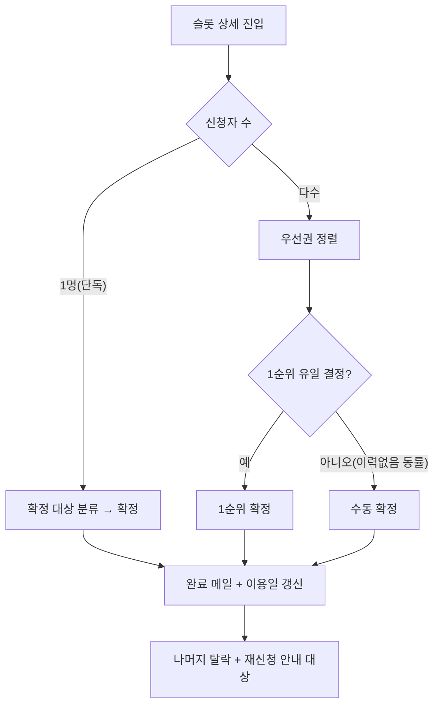

# 03. 관리자 서비스 (Admin Service)

> 상위 문서: [00-개요.md](./00-개요.md) · 이전: [02-예약-서비스.md](./02-예약-서비스.md) · 다음: [04-스케줄러-배치-서비스.md](./04-스케줄러-배치-서비스.md)
> 데이터 정의: [06-DB-논리-명세.md](./06-DB-논리-명세.md)

## 서비스 개요

| 항목 | 내용 |
|------|------|
| 책임 | 관리자 인증, 예약 현황/우선권 확인, 확정·탈락 처리, 재신청 안내 메일, 휴가/운영 설정 |
| 주요 액터 | 관리자 |
| 핵심 엔티티 | `admin_user`, `reservation_cycle`, `slot`, `vacation`, `reservation`, `member`, `operation_setting`, `mail_*` |
| 의존 | 메일/알림 서비스, 운영 설정 |
| 핵심 불변식 | I-1(슬롯당 확정 1), I-2(확정 시 이용일 갱신) |

### 페이지 맵
| 페이지 | 경로(예시) | 주요 액션 |
|--------|-----------|-----------|
| P1 관리자 로그인 | `/admin/login` | 로그인, 권한 제어 |
| P2 대시보드 | `/admin/dashboard` | 현황 요약, 처리 대기/메일 상태 |
| P3 신청 목록 | `/admin/reservations` | 슬롯별 목록, 그룹/필터 |
| P4 신청자 상세 & 우선권 | `/admin/reservations/{slotId}` | 상세, 우선권 정렬 |
| P5 예약 확정 처리 | `/admin/reservations/{slotId}/confirm` | 우선권/수동 확정, 탈락 처리 |
| P6 재신청 안내 메일 | `/admin/reservations/reapply-mail` | 탈락자 조회, 안내 메일 발송 |
| P7 안마사 휴가 관리 | `/admin/vacation` | 휴가 등록/수정/삭제(오픈 전) |
| P8 운영 설정 | `/admin/settings` | 시간/슬롯, 오픈·마감, 메일 템플릿 |

> 모든 관리자 페이지는 [ADM-P1-A2] 권한 검증을 선행한다.

---

## P1. 관리자 로그인 (`/admin/login`)

### [ADM-P1-A1] 관리자 로그인
- 트리거: [로그인]
- 입력: `loginId(or email), password`
- 처리 로직:
  1. `admin_user` 조회 + 활성 여부 확인.
  2. 비밀번호 해시 비교, (옵션)실패 횟수 잠금.
  3. 성공 시 관리자 세션 발급(권한/역할 포함).
- 예외: 자격 불일치 → 일반화 메시지
- 관련 데이터: `admin_user`(read/update)

### [ADM-P1-A2] 접근 권한 제어(공통 가드)
- 트리거: 모든 `/admin/*` 요청
- 처리 로직: 관리자 세션/역할 검증. 미인증/비권한 → 차단(로그인 리다이렉트/403).
- 관련 데이터: 세션

---

## P2. 대시보드 (`/admin/dashboard`)

### [ADM-P2-A1] 운영 상태 표시
- 처리 로직: 현재 시스템 상태(BEFORE_OPEN/OPEN/REAPPLY/CLOSED) + 오픈/마감/재신청 마감 시각 표시.
- 관련 데이터: `reservation_cycle`, `operation_setting`(read)

### [ADM-P2-A2] 주간 현황 요약
- 처리 로직: 활성 사이클의 신청/확정/탈락/취소 건수, 슬롯 점유율(확정/20), 빈 슬롯 수 집계.
- 결과/후처리: 카드/요약 위젯.
- 관련 데이터: `reservation`, `slot`(read·집계)

### [ADM-P2-A3] 처리 대기 알림
- 처리 로직: **확정 대기 슬롯**(신청 존재·미확정), **이력 없음 수동 처리 대상** 슬롯 식별 → 바로가기 제공.
- 관련 데이터: `slot`, `reservation`, `member.last_used_date`(read)

### [ADM-P2-A4] 메일 발송 상태
- 처리 로직: 메일 발송 성공/실패/재시도 현황 집계, 실패 건 수동 재발송 진입.
- 관련 데이터: `mail_message`(read) — [05](./05-메일-알림-서비스.md) 연계

---

## P3. 예약 관리 - 신청 목록 (`/admin/reservations`)

### 표시 항목
날짜·슬롯 / 신청자(이름·이메일) / 신청 구분(일반·재신청) / 신청 시각 / 마지막 이용일(또는 "이력 없음") / 우선권(O·X) / 상태.

### [ADM-P3-A1] 날짜·슬롯별 목록 조회
- 처리 로직: 활성(또는 선택) 사이클의 슬롯 × 신청 건을 날짜/타임 순으로 조회.
- 관련 데이터: `slot`, `reservation`, `member`(read)

### [ADM-P3-A2] 중복 신청 그룹 표시
- 처리 로직: 동일 슬롯 다중 신청을 그룹핑하고 **우선권 정렬**([ADM-P4-A2] 규칙)로 표시.
- 관련 데이터: `reservation`, `member`(read)

### [ADM-P3-A3] 상태 필터 / 상세 진입
- 처리 로직: 신청/확정/탈락/취소 필터링, 슬롯 상세(P4) 이동.

---

## P4. 신청자 상세 & 우선권 확인 (`/admin/reservations/{slotId}`)

### [ADM-P4-A1] 신청자 상세 표시
- 처리 로직: 해당 슬롯 신청자들의 이름·이메일·신청 시각·마지막 이용일·우선권 여부 표시. 이력 없는 신청자는 "이력 없음" 표기.
- 관련 데이터: `reservation`, `member`(read)

### [ADM-P4-A2] 우선권 정렬
- 처리 로직(정렬 키):
  1. **1순위**: `member.last_used_date` 오래된 순. **NULL(이력 없음)=최우선**.
  2. **2순위(동률)**: `reservation.applied_at` 빠른 순.
- 결과/후처리: 1순위 강조. **수동 판단 필요 플래그** 산정:
  - 상위 후보가 이력 없음(NULL)으로 **유일 결정 불가**(동률 NULL 복수) → `needs_manual=true`.
  - 전원 이력 없음 → `needs_manual=true`.
- 관련 데이터: `reservation`, `member`(read)

### [ADM-P4-A3] 이력 없음 표기
- 처리 로직: `last_used_date IS NULL` 신청자 "이력 없음" 라벨, 수동 확정 대상 안내.

> 우선권 정렬/수동 판단 산정의 SQL은 [06 §우선권 쿼리](./06-DB-논리-명세.md#7-우선권-priority-산정-쿼리)에 정의한다.

---

## P5. 예약 확정 처리 (`/admin/reservations/{slotId}/confirm`)

### [ADM-P5-A1] 우선권 기반 확정
- 트리거: 슬롯 상세에서 [확정]
- 전제조건: 관리자, 대상 슬롯 미확정, 확정 대상 신청 선택(기본=1순위)
- 입력: `slotId, reservationId(확정 대상)`
- 처리 로직(**트랜잭션 + 슬롯 락**):
  1. 슬롯 미확정 재확인(I-1). 이미 확정 시 거절.
  2. 선택 신청 `status=확정`, `confirmed_at=now`, `confirmed_by=관리자`.
  3. 슬롯 확정 참조 설정(유니크 1건).
  4. **확정 회원 마지막 이용일 갱신**(`last_used_date=slot_date`) (I-2).
  5. 동일 슬롯 나머지 `신청` → `status=탈락`, `dropped_at=now`([ADM-P5-A3]).
  6. 메일/알림: **예약 완료 메일(일반)** 발송 요청.
- 결과/후처리: "예약이 확정되었습니다." + 탈락자 발생 시 재신청 안내 대상 등록.
- 예외: 이미 확정 → "이미 확정된 슬롯입니다."
- 관련 데이터: `reservation`(update), `slot`(확정 참조), `member`(이용일), `mail_message`

### [ADM-P5-A2] 수동 확정 (이력 없음)
- 트리거: `needs_manual=true` 슬롯에서 관리자가 1명 선택 후 [확정]
- 처리 로직: [ADM-P5-A1]과 동일하되 확정 대상은 **관리자 선택값**. 나머지 탈락.
- 관련 데이터: 동일

### [ADM-P5-A3] 탈락 처리
- 트리거: 확정에 수반 또는 마감 배치([04](./04-스케줄러-배치-서비스.md))
- 처리 로직: 비확정 `신청` → `탈락`. **재신청 안내 대상 등록**(주차+회원). 마지막 이용일 불변.
- 관련 데이터: `reservation`(update)

### 확정 처리 시나리오

---

## P6. 재신청 안내 메일 발송 (`/admin/reservations/reapply-mail`)

### [ADM-P6-A1] 탈락자 조회
- 처리 로직: 해당 주차 `탈락` 상태 회원 목록 조회(중복 제거).
- 관련 데이터: `reservation`, `member`(read)

### [ADM-P6-A2] 빈 슬롯 정보 산출
- 처리 로직: 마감 시점 기준 **확정 없음 & 비휴가** 슬롯 목록 산출(메일 본문 포함용).
- 관련 데이터: `slot`, `reservation`, `vacation`(read)

### [ADM-P6-A3] 안내 메일 발송 / 재발송
- 트리거: 마감 배치 자동([04]) 또는 관리자 [발송]
- 처리 로직: 탈락자에게 빈 슬롯 + 재신청 시간(다음날 17:00까지)·선착순·즉시 확정·취소 불가 안내 메일 발송 요청. 발송 결과(성공/실패/재시도) 추적.
- 결과/후처리: 발송 결과 테이블 갱신, 실패 건 수동 재발송 가능.
- 관련 데이터: `mail_message`(insert/update)

---

## P7. 안마사 휴가 관리 (`/admin/vacation`)

### [ADM-P7-A1] 휴가 등록
- 트리거: 날짜 선택 + [저장]
- 전제조건: 관리자, 대상 주차 **예약 오픈(수 09:00) 전**
- 입력: `cycleId(or 대상 주), dates[]`
- 처리 로직:
  1. **오픈 전** 검증(시스템 상태 BEFORE_OPEN/대상 사이클 미오픈). 오픈 후면 차단.
  2. `vacation` upsert(사이클+날짜). 슬롯 생성 로직에 반영(해당 날짜 슬롯 비활성/예약 불가).
- 결과/후처리: 미리보기에서 예약 불가 반영 확인.
- 예외: 오픈 후 → "예약 오픈 후에는 해당 주차 휴가를 등록할 수 없습니다."
- 관련 데이터: `vacation`(insert), `slot`(반영)

### [ADM-P7-A2] 휴가 수정/삭제
- 전제조건: 오픈 전
- 처리 로직: 등록 휴가 해제/변경, 슬롯 반영 갱신.
- 예외: 오픈 후 차단(동일 메시지).
- 관련 데이터: `vacation`(update/delete)

### [ADM-P7-A3] 반영 미리보기
- 처리 로직: 휴가 적용 후 회원 캘린더 예약 불가 결과를 사전 시뮬레이션 표시.
- 관련 데이터: `vacation`, `slot`(read)

> 휴가 등록 가능 시점(오픈 전)은 스케줄러의 오픈 잡과 강하게 연동된다. 오픈 잡 실행 시 해당 사이클 휴가는 동결된다([04](./04-스케줄러-배치-서비스.md)).

---

## P8. 운영 설정 (`/admin/settings`)

### [ADM-P8-A1] 시간/슬롯 설정
- 처리 로직: 운영 시간·슬롯 구성 변경(기본 13:30~17:00, 4타임). 차기 사이클부터 반영.
- 관련 데이터: `operation_setting`(update)

### [ADM-P8-A2] 오픈/마감/재신청 창 설정
- 처리 로직: 오픈 요일·시각(수 09:00), 마감(수 17:00), 재신청 마감(목 17:00) 변경.
- 관련 데이터: `operation_setting`(update)

### [ADM-P8-A3] 메일 템플릿 관리
- 처리 로직: 메일 종류별 제목/본문 템플릿 등록·수정. [05](./05-메일-알림-서비스.md)에서 사용.
- 관련 데이터: `mail_template`(update)

> 설정 변경은 **진행 중 사이클에 즉시 반영하지 않고 차기 사이클부터 적용**함을 기본 정책으로 한다(운영 일관성).

---

## 검증 규칙 요약 (관리자 서비스)

| 액션 | 검증 | 실패 처리 |
|------|------|-----------|
| 확정 | 슬롯 미확정(I-1), 트랜잭션/락 | "이미 확정된 슬롯" |
| 수동 확정 | needs_manual 슬롯, 1명 선택 | 선택 강제 |
| 휴가 등록/수정 | 오픈 전만 | "오픈 후 등록 불가" |
| 설정 변경 | 권한 + 차기 사이클 적용 | 진행 사이클 보호 |

## 메일 트리거 요약
| 시점 | 메일 |
|------|------|
| 일반 확정 | 예약 완료 메일(일반) |
| 탈락 발생/마감 | 탈락·재신청 안내 메일(자동/수동) |
