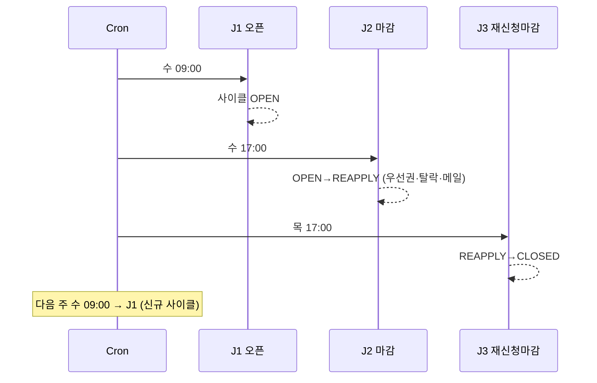
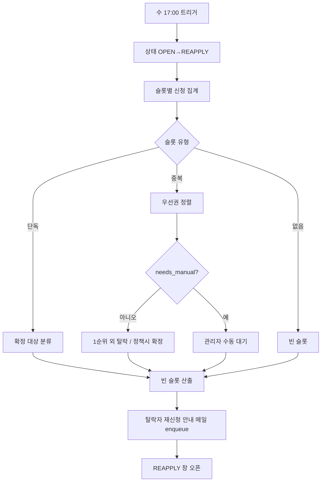

# 04. 스케줄러 / 배치 서비스 (Scheduler / Batch Service)

> 상위 문서: [00-개요.md](./00-개요.md) · 이전: [03-관리자-서비스.md](./03-관리자-서비스.md) · 다음: [05-메일-알림-서비스.md](./05-메일-알림-서비스.md)
> 데이터 정의: [06-DB-논리-명세.md](./06-DB-논리-명세.md)

## 서비스 개요

| 항목 | 내용 |
|------|------|
| 책임 | 시간 기반 시스템 상태 전환, 차주 슬롯 생성, 마감 시 우선권 정렬·탈락 처리, 자동 메일 트리거, 메일 재시도 |
| 주요 액터 | 시스템(Cron, KST) |
| UI | 없음 — **잡(Job) > 액션** 구조 |
| 핵심 엔티티 | `reservation_cycle`, `slot`, `vacation`, `reservation`, `member`, `mail_message` |
| 핵심 원칙 | **멱등성**(재실행 안전), **원자성**(상태 전이+데이터 변경 트랜잭션), **동시성 안전** |

### 잡 스케줄(기본값)
| 잡 ID | 시각(KST) | 목적 |
|-------|-----------|------|
| J1 사이클 생성/오픈 | 매주 수 09:00 | 차주 사이클 생성·슬롯 생성·휴가 동결, 상태 OPEN |
| J2 마감 배치 | 매주 수 17:00 | 신청 마감, 우선권 정렬·탈락, 안내 메일, 상태 REAPPLY |
| J3 재신청 창 마감 | 매주 목 17:00 | 상태 CLOSED, 모든 신청 종료 |
| J4 메일 재시도 | 주기적(예: 5분) | 실패 메일 재발송 |
| (옵션) J0 사전 생성 | 오픈 전(예: 화) | 차주 사이클 미리 생성(휴가 등록 대상 노출) |

> 시각/요일은 `operation_setting`의 정책값. 본 표는 기본값이다.

### 상태 전이 총괄

---

## J0. (옵션) 차주 사이클 사전 생성

### [BAT-J0-A1] 사이클 사전 생성
- 트리거: 오픈 전 사전 시점(예: 직전 화요일) 또는 관리자 수동
- 목적: 관리자가 **오픈 전 휴가 등록**을 할 수 있도록 차주 사이클/슬롯 골격을 미리 만든다.
- 처리 로직:
  1. 차주(다음 주 월~금) 대상 `reservation_cycle` 생성(`state=BEFORE_OPEN`, open/close/reapply 시각 계산).
  2. 슬롯 골격 생성(월~금 × 4타임). 이 단계의 슬롯은 휴가 편집 가능.
  3. 멱등성: 동일 대상 주 사이클 존재 시 재생성하지 않음(유니크 키 `target_week_start`).
- 관련 데이터: `reservation_cycle`(insert), `slot`(insert)

> J0를 두지 않으면 J1에서 사이클/슬롯을 생성하되, 휴가 등록은 J1 이전(BEFORE_OPEN)에만 가능하도록 별도 사이클 선생성이 필요하다. 운영상 **J0 권장**.

---

## J1. 사이클 오픈 (수 09:00)

### [BAT-J1-A1] 사이클 확정/슬롯 확정/휴가 동결
- 트리거: Cron 수 09:00
- 전제조건: 대상 차주 사이클 존재(J0) 또는 즉시 생성
- 처리 로직(**트랜잭션, 멱등**):
  1. 대상 사이클 식별. 없으면 생성.
  2. 슬롯 미생성 시 생성(월~금 × 4타임).
  3. **휴가 동결**: 현재 등록된 `vacation`을 슬롯에 반영(`slot.is_vacation` 확정). 이후 휴가 등록 차단.
  4. `reservation_cycle.state = OPEN`, `opened_at=now`.
  5. 멱등 가드: 이미 OPEN 처리됨이면 스킵.
- 결과/후처리: 회원 신청 가능. 관리자 휴가 등록 차단.
- 예외/보정: 잡 누락(서버 다운) 시 **시각 파생 상태**로 보정하거나 수동 재실행(멱등).
- 관련 데이터: `reservation_cycle`(update), `slot`(insert/update), `vacation`(read)

---

## J2. 마감 배치 (수 17:00) — 핵심 잡

### 목적
일반 신청 마감, 슬롯별 우선권 정렬, 탈락 처리, 탈락 안내 메일, 재신청 창 오픈.

### [BAT-J2-A1] 신청 마감 (상태 전이)
- 처리 로직: `reservation_cycle.state = REAPPLY`, `closed_at=now`. 이후 신청/취소 차단(서비스 계층 검증과 일치).
- 멱등: 이미 REAPPLY면 스킵(단, 후속 액션 처리 여부 별도 플래그로 관리).
- 관련 데이터: `reservation_cycle`(update)

### [BAT-J2-A2] 슬롯별 신청 집계 & 분류
- 처리 로직: 활성 사이클의 각 슬롯에 대해 `status=신청` 건을 그룹핑.
  - **단독 신청**: 신청자 1명 → "확정 대상" 분류.
  - **중복 신청**: 다수 → 우선권 정렬 대상.
  - **신청 없음**: 빈 슬롯(재신청 대상).
- 관련 데이터: `reservation`, `slot`(read)

### [BAT-J2-A3] 우선권 정렬 & 탈락 처리
- 처리 로직(슬롯 단위, 트랜잭션):
  1. 정렬 키: `member.last_used_date` ASC(NULL=최우선) → `applied_at` ASC.
  2. **수동 판단 필요** 산정(이력 없음 동률/전원 이력 없음) → `needs_manual` 플래그, 자동 확정 보류.
  3. **확정 정책 분기**(AS-1):
     - 기본(관리자 확정 모드): 1순위 외 신청을 **`탈락`** 처리. 1순위는 **확정 보류**(관리자 [ADM-P5]에서 확정).
     - 자동 확정 모드(운영 설정): 1순위(또는 단독)를 **`확정`** 처리 + 이용일 갱신 + 완료 메일, 나머지 `탈락`.
  4. `needs_manual=true` 슬롯은 어떤 모드든 자동 확정하지 않고 관리자 대기.
- 결과/후처리: 탈락자 집합 확정.
- 멱등: 이미 처리된 슬롯(처리 플래그) 재처리 금지.
- 관련 데이터: `reservation`(update), `member`(자동 확정 시 이용일), `slot`(확정 참조)

> 정렬/수동 판단 SQL은 [06 §우선권 쿼리](./06-DB-논리-명세.md#7-우선권-priority-산정-쿼리) 참조.

### [BAT-J2-A4] 빈 슬롯 산출
- 처리 로직: 마감 시점 기준 **확정 없음 & 비휴가** 슬롯 목록 산출(재신청·안내 메일용 스냅샷).
- 관련 데이터: `slot`, `reservation`(read)

### [BAT-J2-A5] 탈락/재신청 안내 메일 자동 발송
- 처리 로직: 탈락자별로 빈 슬롯 + 재신청 시간(다음날 17:00까지)·선착순·즉시 확정·취소 불가 안내 메일을 **메일 큐 enqueue**.
- 멱등: 동일 주차·회원·메일 종류 유니크 키로 중복 발송 방지.
- 관련 데이터: `mail_message`(insert) — [05](./05-메일-알림-서비스.md)

### [BAT-J2-A6] 재신청 창 오픈
- 처리 로직: 상태 REAPPLY 유지 확정(수17:00~목17:00). 탈락자 한정 재신청 활성([RSV-P3](./02-예약-서비스.md#p3-탈락자-재신청-reservationreapply--선착순즉시-확정취소-불가)).
- 관련 데이터: `reservation_cycle`(read)

### 마감 배치 흐름

---

## J3. 재신청 창 마감 (목 17:00)

### [BAT-J3-A1] 사이클 종료
- 처리 로직: `reservation_cycle.state = CLOSED`, `reapply_closed_at=now`. 모든 신청/재신청 차단.
- 멱등: 이미 CLOSED면 스킵.
- 결과/후처리: 다음 차주 일정은 다음 주 수 09:00(J1)에 신규 오픈.
- 관련 데이터: `reservation_cycle`(update)

---

## J4. 메일 재시도 잡 (주기적)

### [BAT-J4-A1] 실패 메일 재발송
- 트리거: 주기적(예: 5분)
- 처리 로직:
  1. `mail_message.status=실패` & `retry_count < N` & 백오프 경과 건 조회.
  2. 발송 재시도 → 성공 시 `성공`, 실패 시 `retry_count++`·`last_tried_at` 갱신.
  3. 최대 재시도 초과 → `실패(영구)` 표시, 관리자 대시보드 노출.
- 멱등: 발송 단위 락/상태 가드로 중복 발송 방지.
- 관련 데이터: `mail_message`(read/update) — [05](./05-메일-알림-서비스.md)

---

## 단계별 상태 전이표

| 단계 | 시점 | 트리거 | 시스템 상태 | 예약 상태 변화 | 주요 처리 |
|------|------|--------|-------------|----------------|-----------|
| 0. 휴가 등록 | 오픈 전 | 관리자 | BEFORE_OPEN | - | 차주 휴가 등록 |
| 1. 오픈 | 수 09:00 | J1 | BEFORE_OPEN→OPEN | - | 슬롯 확정, 휴가 동결 |
| 2. 신청 | 수 09:00~16:59 | 회원 | OPEN | (없음)→신청 | 중복 신청 허용 |
| 3. 취소 | 수 09:00~16:59 | 회원 | OPEN | 신청→취소 | 우선권 무영향 |
| 4. 마감 | 수 17:00 | J2 | OPEN→REAPPLY | - | 신청/취소 차단 |
| 5. 정렬 | 수 17:00 | J2 | REAPPLY | 신청 분류 | 우선권 정렬 |
| 6-1. 확정 | 수 17:00~ | 관리자/J2(자동모드) | REAPPLY | 신청→확정 | 완료 메일, 이용일 갱신 |
| 6-2. 탈락 | 수 17:00 | J2 | REAPPLY | 신청→탈락 | 재신청 안내 메일 |
| 7. 재신청 | 수17:00~목17:00 | 탈락자 | REAPPLY | 탈락→확정 | 선착순 즉시 확정 |
| 8. 재신청 마감 | 목 17:00 | J3 | REAPPLY→CLOSED | - | 모든 신청 종료 |
| 9. 대기 | 목17:00~다음 수09:00 | - | CLOSED | - | 다음 사이클 대기 |

## 핵심 분기 로직

| 분기 | 조건 | 처리 |
|------|------|------|
| 단독 신청 슬롯 | 마감 시 신청 1명 | 확정 대상 분류(관리자/자동 확정) |
| 중복 신청(이력 보유) | 다수, last_used_date 비교 가능 | 1순위 확정/나머지 탈락 |
| 중복 신청(이력 없음) | 상위 동률 NULL/전원 NULL | 수동 확정 |
| 탈락자 재신청 | REAPPLY, 빈 슬롯 | 선착순 즉시 확정(경합 시 거절) |
| 사이클 종료 | 목 17:00 | CLOSED, 다음 주 신규 오픈 |

## 비기능 / 운영 고려

| 항목 | 정책 |
|------|------|
| 멱등성 | 모든 잡은 처리 플래그/유니크 키로 재실행 안전 |
| 원자성 | 상태 전이 + 데이터 변경은 단일 트랜잭션. 부분 실패 시 롤백 |
| 시계 정합 | KST 고정. 서버 시간 동기화(NTP) 필수 |
| 누락 복구 | 잡 누락 시 시각 파생 상태 보정 + 수동 재실행(멱등) |
| 관측성 | 잡 실행 로그/결과(처리 건수, 메일 enqueue 수) 기록 |
| 부하 | 슬롯 20개 규모로 경량. 회원 증가 시 슬롯 단위 처리로 확장 |
