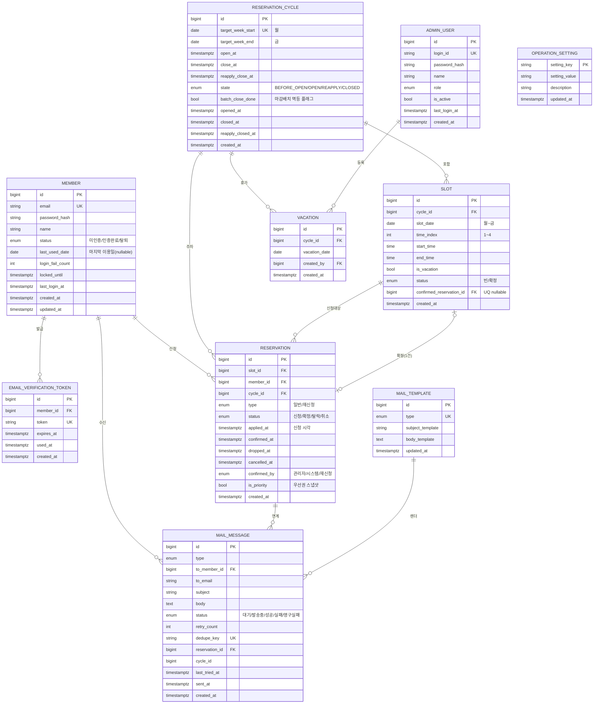

# 06. DB 논리 명세 (Logical Data Model)

> 상위 문서: [00-개요.md](./00-개요.md) · 이전: [05-메일-알림-서비스.md](./05-메일-알림-서비스.md) · 다음: [07-개발-스펙.md](./07-개발-스펙.md)

본 문서는 서비스 비즈니스 로직([01](./01-계정-서비스.md)~[05](./05-메일-알림-서비스.md))을 충족하는 **논리 데이터 모델**을 정의한다.
물리 타입/엔진/인덱스 튜닝은 [07 개발 스펙](./07-개발-스펙.md) 및 구현 단계에서 확정한다.

## 1. 표기 규칙
- 키: **PK**(기본키), **FK**(외래키), **UQ/UK**(유니크 — 본문은 UQ, ERD 다이어그램은 Mermaid 표준 `UK` 표기), **IDX**(인덱스).
- 상태 코드는 (한글 표기 / ENUM 값) 병기. 구현 시 ENUM 값을 사용.
- 시각 컬럼은 KST 기준 표시, 저장은 UTC `timestamptz` 권장.

---

## 2. ERD



---

## 3. 엔티티 상세 명세

### 3.1 `member` — 회원
| 컬럼 | 타입 | 제약 | 설명 |
|------|------|------|------|
| id | bigint | PK | 회원 식별자 |
| email | varchar(255) | UQ(활성 조건) | 로그인 ID, 전역 유일 |
| password_hash | varchar(255) | NN | 단방향 해시(+salt) |
| name | varchar(50) | NN | 이름(1~50) |
| status | enum | NN, default 미인증 | 미인증/인증완료/탈퇴 |
| last_used_date | date | NULL | **마지막 이용일**(확정 시 갱신, 취소/탈락 불변) |
| login_fail_count | int | NN default 0 | 로그인 실패 누적 |
| locked_until | timestamptz | NULL | 잠금 해제 시각 |
| last_login_at | timestamptz | NULL | 최근 로그인 |
| created_at / updated_at | timestamptz | NN | 생성/수정 |

- **UQ**: `email` — 단, 탈퇴 재가입 허용 시 `UQ(email) WHERE status <> '탈퇴'` 부분 유니크.
- **IDX**: `last_used_date`(우선권 정렬), `status`.
- 규칙: `last_used_date`는 [I-2] 확정 시에만 `slot_date`로 갱신(최신값 유지).

### 3.2 `admin_user` — 관리자
| 컬럼 | 타입 | 제약 | 설명 |
|------|------|------|------|
| id | bigint | PK | |
| login_id | varchar(100) | UQ NN | 관리자 로그인 ID |
| password_hash | varchar(255) | NN | |
| name | varchar(50) | NN | |
| role | enum | NN | 권한(예: ADMIN/SUPER) |
| is_active | bool | NN default true | 활성 여부 |
| last_login_at | timestamptz | NULL | |
| created_at | timestamptz | NN | |

> 회원/관리자 통합 모델(단일 `account` + role)도 가능(AS-4). 본 명세는 분리 모델을 기본으로 한다.

### 3.3 `email_verification_token` — 이메일 인증 토큰
| 컬럼 | 타입 | 제약 | 설명 |
|------|------|------|------|
| id | bigint | PK | |
| member_id | bigint | FK→member NN | 대상 회원 |
| token | varchar(255) | UQ NN | 난수 토큰(URL 안전) |
| expires_at | timestamptz | NN | 만료(기본 발급+24h) |
| used_at | timestamptz | NULL | 사용 시각(1회성) |
| created_at | timestamptz | NN | |

- **IDX**: `member_id`, `expires_at`.
- 규칙: 검증 성공 시 `used_at` 기록(재사용 불가). 재발송 시 신규 row.

### 3.4 `reservation_cycle` — 예약 사이클(주차)
| 컬럼 | 타입 | 제약 | 설명 |
|------|------|------|------|
| id | bigint | PK | |
| target_week_start | date | UQ NN | 대상 주 월요일(사이클 식별) |
| target_week_end | date | NN | 대상 주 금요일 |
| open_at | timestamptz | NN | 오픈 예정(수 09:00) |
| close_at | timestamptz | NN | 마감 예정(수 17:00) |
| reapply_close_at | timestamptz | NN | 재신청 마감(목 17:00) |
| state | enum | NN | BEFORE_OPEN/OPEN/REAPPLY/CLOSED |
| batch_close_done | bool | NN default false | 마감배치 멱등 플래그 |
| opened_at / closed_at / reapply_closed_at | timestamptz | NULL | 실제 처리 시각 |
| created_at | timestamptz | NN | |

- **UQ**: `target_week_start`(주차 1개, 멱등 생성 키).
- **IDX**: `state`, `open_at`.
- 규칙: `state`는 스케줄러가 전이([04](./04-스케줄러-배치-서비스.md)). 잡 누락 시 시각으로 보정 가능.

### 3.5 `slot` — 슬롯
| 컬럼 | 타입 | 제약 | 설명 |
|------|------|------|------|
| id | bigint | PK | |
| cycle_id | bigint | FK→cycle NN | 소속 사이클 |
| slot_date | date | NN | 월~금 |
| time_index | smallint | NN | 1~4 타임 |
| start_time / end_time | time | NN | 슬롯 시간 |
| is_vacation | bool | NN default false | 휴가(오픈 시 동결) |
| status | enum | NN default 빈 | 빈/확정 |
| confirmed_reservation_id | bigint | FK→reservation, UQ NULL | **확정된 신청(1건)** |
| created_at | timestamptz | NN | |

- **UQ**: `(cycle_id, slot_date, time_index)` — 슬롯 유일.
- **UQ**: `confirmed_reservation_id` — 확정 참조 유일.
- **IDX**: `(cycle_id, slot_date)`, `status`.
- 규칙[I-1]: 슬롯당 확정 1건. `confirmed_reservation_id`로 1:1 보장 + `reservation` 측 부분 유니크 이중 방어.

### 3.6 `vacation` — 안마사 휴가
| 컬럼 | 타입 | 제약 | 설명 |
|------|------|------|------|
| id | bigint | PK | |
| cycle_id | bigint | FK→cycle NN | 대상 사이클 |
| vacation_date | date | NN | 휴가 날짜 |
| created_by | bigint | FK→admin_user | 등록 관리자 |
| created_at | timestamptz | NN | |

- **UQ**: `(cycle_id, vacation_date)`.
- 규칙: 오픈 전(BEFORE_OPEN)에만 insert/update/delete([ADM-P7]). 오픈 시 `slot.is_vacation`에 반영·동결.

### 3.7 `reservation` — 예약(신청/확정/탈락/취소)
| 컬럼 | 타입 | 제약 | 설명 |
|------|------|------|------|
| id | bigint | PK | |
| slot_id | bigint | FK→slot NN | 대상 슬롯 |
| member_id | bigint | FK→member NN | 신청자 |
| cycle_id | bigint | FK→cycle NN | 주차(조회 비정규화) |
| type | enum | NN | 일반(NORMAL)/재신청(REAPPLY) |
| status | enum | NN default 신청 | 신청/확정/탈락/취소 |
| applied_at | timestamptz | NN | 신청 시각(우선권 2순위) |
| confirmed_at | timestamptz | NULL | 확정 시각 |
| dropped_at | timestamptz | NULL | 탈락 시각 |
| cancelled_at | timestamptz | NULL | 취소 시각 |
| confirmed_by | enum | NULL | 관리자/시스템/재신청 |
| is_priority | bool | NULL | 우선권 보유 스냅샷(표시용) |
| created_at | timestamptz | NN | |

- **부분 UQ-1 [I-1]**: `(slot_id) WHERE status = '확정'` — 슬롯당 확정 1.
- **부분 UQ-2 [I-5]**: `(slot_id, member_id) WHERE status <> '취소'` — 동일 회원·슬롯 활성 1.
- **IDX**: `(slot_id, status)`, `(cycle_id, status)`, `(member_id, status)`, `applied_at`.
- 상태 전이 규칙: [00 §5.2/5.3](./00-개요.md#52-예약-상태reservation-status) 불변식 적용.

### 3.8 `mail_message` — 메일 발송 큐/로그
| 컬럼 | 타입 | 제약 | 설명 |
|------|------|------|------|
| id | bigint | PK | |
| type | enum | NN | EMAIL_VERIFY 등([05](./05-메일-알림-서비스.md)) |
| to_member_id | bigint | FK→member NULL | 수신 회원(가입자/회원) |
| to_email | varchar(255) | NN | 수신 주소 스냅샷 |
| subject | varchar(255) | NN | 렌더된 제목 |
| body | text | NN | 렌더된 본문 |
| status | enum | NN default 대기 | 대기/발송중/성공/실패/영구실패 |
| retry_count | int | NN default 0 | 재시도 횟수 |
| dedupe_key | varchar(255) | UQ NULL | 중복 방지 키 |
| reservation_id | bigint | FK→reservation NULL | 연계 예약 |
| cycle_id | bigint | NULL | 연계 주차 |
| last_tried_at / sent_at | timestamptz | NULL | 시도/성공 시각 |
| last_error | text | NULL | 마지막 오류 |
| created_at | timestamptz | NN | |

- **UQ**: `dedupe_key`(멱등 발송).
- **IDX**: `status`, `(status, retry_count, last_tried_at)`(재시도 스캔).

### 3.9 `mail_template` — 메일 템플릿
| 컬럼 | 타입 | 제약 | 설명 |
|------|------|------|------|
| id | bigint | PK | |
| type | enum | UQ NN | 메일 종류 |
| subject_template | varchar(255) | NN | 제목 템플릿 |
| body_template | text | NN | 본문 템플릿(치환 변수) |
| updated_at | timestamptz | NN | |

### 3.10 `operation_setting` — 운영 설정(키-값)
| 컬럼 | 타입 | 제약 | 설명 |
|------|------|------|------|
| setting_key | varchar(100) | PK | 설정 키 |
| setting_value | varchar(500) | NN | 값(스칼라/JSON) |
| description | varchar(255) | NULL | 설명 |
| updated_at | timestamptz | NN | |

- 주요 키(예시):
  | key | 기본값 | 설명 |
  |-----|--------|------|
  | `open.dow` / `open.time` | WED / 09:00 | 오픈 요일·시각 |
  | `close.time` | 17:00 | 마감 시각 |
  | `reapply.close.dow` / `reapply.close.time` | THU / 17:00 | 재신청 마감 |
  | `slot.times` | `[{"i":1,"s":"13:30","e":"14:00"}, ...]` | 슬롯 구성(JSON) |
  | `confirm.mode` | MANUAL | 확정 모드(MANUAL/AUTO, AS-1) |
  | `verify.token.ttlHours` | 24 | 인증 토큰 만료 |
  | `mail.retry.max` | 3 | 메일 최대 재시도 |

### 3.11 (옵션) 보조 테이블
- `login_attempt`(id, subject_type, subject_id, ip, success, attempted_at) — 로그인 보안 감사.
- `admin_action_log`(id, admin_user_id, action, target_type, target_id, payload, created_at) — 확정/취소 등 관리자 행위 감사.

---

## 4. 핵심 제약 ↔ 불변식 매핑

| 불변식 | DB 구현 |
|--------|---------|
| I-1 슬롯당 확정 1 | `slot.confirmed_reservation_id` UQ + `reservation (slot_id) WHERE status=확정` 부분 UQ |
| I-2 확정 시 이용일 갱신 | 확정 트랜잭션에서 `member.last_used_date = slot.slot_date`(애플리케이션 규칙) |
| I-3 재신청 확정 취소 불가 | `type=재신청 & status=확정` 행 취소 전이 금지(서비스 가드) |
| I-4 마감 후 취소 불가 | 취소 전 `cycle.state=OPEN` 검증(서비스 가드) |
| I-5 동일 회원·슬롯 1건 | `reservation (slot_id, member_id) WHERE status<>취소` 부분 UQ |

---

## 5. 상태 코드 ENUM 정의

| 도메인 | 코드(값) |
|--------|----------|
| member.status | `PENDING(미인증)`, `ACTIVE(인증완료)`, `WITHDRAWN(탈퇴)` |
| cycle.state | `BEFORE_OPEN`, `OPEN`, `REAPPLY`, `CLOSED` |
| slot.status | `OPEN(빈)`, `CONFIRMED(확정)` |
| reservation.type | `NORMAL(일반)`, `REAPPLY(재신청)` |
| reservation.status | `REQUESTED(신청)`, `CONFIRMED(확정)`, `DROPPED(탈락)`, `CANCELLED(취소)` |
| reservation.confirmed_by | `ADMIN(관리자)`, `SYSTEM(시스템/배치)`, `REAPPLY(재신청)` |
| mail.status | `PENDING`, `SENDING`, `SENT`, `FAILED`, `DEAD` |

---

## 6. 대표 조회/집계 패턴

### 6.1 회원 캘린더(차주 슬롯 상태) — [RSV-P2-A1]
```sql
SELECT s.id, s.slot_date, s.time_index, s.is_vacation, s.status,
       SUM(CASE WHEN r.status = 'REQUESTED' THEN 1 ELSE 0 END)            AS request_cnt,
       MAX(CASE WHEN r.member_id = :me AND r.status = 'REQUESTED' THEN 1 ELSE 0 END) AS mine,
       MAX(CASE WHEN r.status = 'CONFIRMED' THEN 1 ELSE 0 END)            AS confirmed
FROM slot s
LEFT JOIN reservation r ON r.slot_id = s.id AND r.status IN ('REQUESTED','CONFIRMED')
WHERE s.cycle_id = :cycleId
GROUP BY s.id, s.slot_date, s.time_index, s.is_vacation, s.status
ORDER BY s.slot_date, s.time_index;
```

### 6.2 빈 슬롯(재신청 대상) — [RSV-P3-A1] / [BAT-J2-A4]
```sql
SELECT s.*
FROM slot s
WHERE s.cycle_id = :cycleId
  AND s.is_vacation = false
  AND s.status <> 'CONFIRMED'
ORDER BY s.slot_date, s.time_index;
```

### 6.3 주간 현황 요약 — [ADM-P2-A2]
```sql
SELECT r.status, COUNT(*) AS cnt
FROM reservation r
WHERE r.cycle_id = :cycleId
GROUP BY r.status;
```

---

## 7. 우선권(Priority) 산정 쿼리

> 규칙: `last_used_date` 오래된 순(NULL=최우선) → 동률 시 `applied_at` 빠른 순. (참조: [03 §P4](./03-관리자-서비스.md#p4-신청자-상세--우선권-확인-adminreservationsslotid), [00 AS-3](./00-개요.md#9-설계-가정-및-확인-필요-사항assumptions))

### 7.1 슬롯 내 우선순위 랭킹
```sql
SELECT r.id            AS reservation_id,
       r.member_id,
       r.applied_at,
       m.last_used_date,
       (m.last_used_date IS NULL) AS no_history,
       ROW_NUMBER() OVER (
         PARTITION BY r.slot_id
         ORDER BY m.last_used_date ASC NULLS FIRST, r.applied_at ASC
       ) AS priority_rank
FROM reservation r
JOIN member m ON m.id = r.member_id
WHERE r.slot_id = :slotId
  AND r.status = 'REQUESTED'
ORDER BY priority_rank;
```
- `priority_rank = 1` → 우선권 보유(1순위). 나머지 → 탈락 후보.

### 7.2 수동 확정 필요(needs_manual) 판정
> 정책: **이력 없는 신청자가 2명 이상 최상위에서 경합**하거나 **전원 이력 없음**이면 공정 자동 판단 불가 → 관리자 수동 확정. (이력 있는 신청자 간에는 `last_used_date`/`applied_at`로 자동 판단)

```sql
SELECT
  -- 신청자 수
  COUNT(*)                                          AS applicant_cnt,
  -- 이력 없음(NULL) 신청자 수
  SUM(CASE WHEN m.last_used_date IS NULL THEN 1 ELSE 0 END) AS no_history_cnt,
  -- 수동 필요: 이력 없음 신청자가 2명 이상(최상위 NULL 경합) 또는 전원 이력 없음
  CASE
    WHEN SUM(CASE WHEN m.last_used_date IS NULL THEN 1 ELSE 0 END) >= 2 THEN true
    ELSE false
  END AS needs_manual
FROM reservation r
JOIN member m ON m.id = r.member_id
WHERE r.slot_id = :slotId
  AND r.status = 'REQUESTED';
```
- `applicant_cnt = 1`(단독 신청)은 우선권 경합이 없으므로 확정 대상 분류(자동/관리자 확정).
- `needs_manual = true` → 자동 확정 보류, 관리자 [ADM-P5-A2] 수동 확정.

### 7.3 확정 트랜잭션(개념)
```sql
BEGIN;
  -- 1) 슬롯 락 + 미확정 확인
  SELECT id FROM slot WHERE id = :slotId AND status <> 'CONFIRMED' FOR UPDATE;
  -- 2) 대상 신청 확정
  UPDATE reservation
     SET status='CONFIRMED', confirmed_at=now(), confirmed_by=:by, is_priority=true
   WHERE id = :winnerReservationId AND status='REQUESTED';
  -- 3) 슬롯 확정 참조 + 상태
  UPDATE slot SET status='CONFIRMED', confirmed_reservation_id=:winnerReservationId
   WHERE id = :slotId;
  -- 4) 마지막 이용일 갱신 (I-2)
  UPDATE member m
     SET last_used_date = GREATEST(COALESCE(m.last_used_date, '0001-01-01'), :slotDate)
   WHERE m.id = :winnerMemberId;
  -- 5) 나머지 신청 탈락
  UPDATE reservation
     SET status='DROPPED', dropped_at=now(), is_priority=false
   WHERE slot_id = :slotId AND status='REQUESTED' AND id <> :winnerReservationId;
COMMIT;
-- 6) (커밋 후) 완료 메일 enqueue + 탈락자 재신청 안내 enqueue
```

> 재신청 즉시 확정([RSV-P3-A2])도 1)~4)를 동일하게 적용하되, `confirmed_by='REAPPLY'`, `type='REAPPLY'`, 탈락 처리(5)는 없음.

---

## 8. 데이터 수명/보존(개략)
| 데이터 | 보존 정책(예시) |
|--------|-----------------|
| `email_verification_token` | 만료/사용 후 N일 후 정리 |
| `reservation`/`slot`/`cycle` | 운영 이력 장기 보존(통계) |
| `mail_message` | 발송 로그 보존 기간 후 아카이브 |
| `member`(탈퇴) | 소프트 삭제 + 개인정보 마스킹/보존 정책 |
