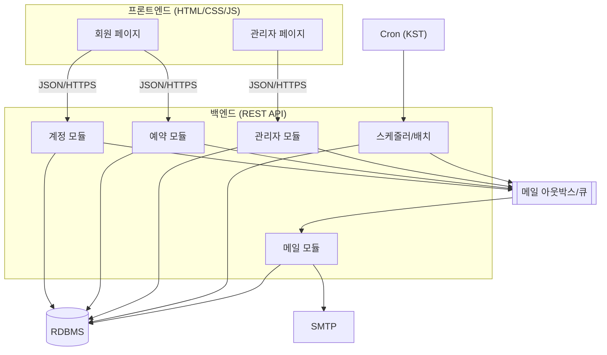

# 07. 개발 스펙 (Development Specification)

> 상위 문서: [00-개요.md](./00-개요.md) · 이전: [06-DB-논리-명세.md](./06-DB-논리-명세.md)

본 문서는 [01](./01-계정-서비스.md)~[06](./06-DB-논리-명세.md)의 설계를 구현하기 위한 **기술 스펙**을 정의한다.
API·동시성·보안·배치·비기능 요구사항을 포함한다.

---

## 1. 기술 스택

### 1.1 프론트엔드
- **HTML5 + CSS3 + Vanilla JavaScript** (React 등 SPA 프레임워크 미사용 — 프로젝트 규칙/AS-6).
- 페이지 전환은 다중 페이지(MPA) 또는 경량 라우팅(History API) 중 택1. 초기에는 **MPA** 권장(서버 렌더 + 부분 fetch).
- 비동기 통신: `fetch` 기반 JSON API 호출.
- 디자인 토큰: `디자인 레퍼런스/`의 Calendly 스타일(`variables.css`/`theme.css`) 적용. (아래 §7)

### 1.2 백엔드(제안, 조정 가능)
- 언어/런타임: 임의(예: Node.js, Java/Spring, Python 등). 본 스펙은 **REST + RDB** 전제로 기술.
- DB: **RDBMS**(PostgreSQL 권장 — 부분 유니크 인덱스/`NULLS FIRST`/`timestamptz` 지원).
- 스케줄러: Cron(시스템) 또는 앱 내 스케줄러(KST 고정).
- 메일: SMTP/메일 게이트웨이 + 비동기 큐(아웃박스).

### 1.3 공통
- 시간대: **Asia/Seoul** 고정. 저장 UTC, 표시 변환.
- 인증: 세션 쿠키(HttpOnly/Secure) 또는 토큰. 회원/관리자 분리.

---

## 2. 시스템 아키텍처



- 계층: `Controller(API) → Service(비즈니스 로직/트랜잭션) → Repository(DB)`.
- 횡단 관심사: 인증 가드, 시스템 상태 가드, 트랜잭션, 예외→에러코드 변환, 로깅.

---

## 3. API 명세

### 3.1 공통 규약
- Base: `/api`. 형식: JSON. 인증: 세션/토큰.
- 성공: `2xx` + `{ data }`. 실패: `4xx/5xx` + `{ error: { code, message } }`.
- 시스템 상태/권한 위반은 표준 에러코드로 반환(아래 §3.5).

### 3.2 회원 API (계정·예약)
| Method | Path | 설명 | 액션 | 권한 |
|--------|------|------|------|------|
| POST | `/api/auth/check-email` | 이메일 중복 검사 | ACC-P1-A1 | 공개 |
| POST | `/api/auth/signup` | 회원가입 | ACC-P1-A2 | 공개 |
| POST | `/api/auth/verify` | 이메일 인증(token) | ACC-P2-A1 | 공개 |
| POST | `/api/auth/verify/resend` | 인증 메일 재발송 | ACC-P2-A2 | 공개 |
| POST | `/api/auth/login` | 로그인 | ACC-P3-A1 | 공개 |
| POST | `/api/auth/logout` | 로그아웃 | ACC-P3-A3 | 회원 |
| GET | `/api/me/profile` | 내 정보 조회 | ACC-P4-A1 | 회원 |
| PUT | `/api/me/password` | 비밀번호 변경 | ACC-P4-A2 | 회원 |
| DELETE | `/api/me` | 회원 탈퇴 | ACC-P4-A3 | 회원 |
| GET | `/api/system/state` | 현재 시스템 상태/배너 | RSV-P1-A1 | 공개 |
| GET | `/api/reservation/calendar` | 차주 슬롯 캘린더 | RSV-P2-A1 | 회원 |
| POST | `/api/reservation/slots/{slotId}/apply` | 슬롯 신청 | RSV-P2-A2 | 회원 |
| POST | `/api/reservation/{reservationId}/cancel` | 신청 취소(마감 전) | RSV-P2-A3 / P4-A2 | 회원 |
| GET | `/api/reservation/reapply/slots` | 빈 슬롯 조회(재신청) | RSV-P3-A1 | 회원(탈락자) |
| POST | `/api/reservation/reapply/slots/{slotId}` | 재신청(즉시 확정) | RSV-P3-A2 | 회원(탈락자) |
| GET | `/api/me/reservations` | 내 예약 내역 | RSV-P4-A1 | 회원 |

### 3.3 관리자 API
| Method | Path | 설명 | 액션 | 권한 |
|--------|------|------|------|------|
| POST | `/api/admin/login` | 관리자 로그인 | ADM-P1-A1 | 공개 |
| GET | `/api/admin/dashboard` | 대시보드 요약 | ADM-P2-* | 관리자 |
| GET | `/api/admin/reservations` | 신청 목록(필터) | ADM-P3-* | 관리자 |
| GET | `/api/admin/reservations/slots/{slotId}` | 신청자 상세·우선권 | ADM-P4-* | 관리자 |
| POST | `/api/admin/reservations/slots/{slotId}/confirm` | 예약 확정(우선권/수동) | ADM-P5-A1/A2 | 관리자 |
| GET | `/api/admin/reapply-mail/targets` | 탈락자/빈 슬롯 조회 | ADM-P6-A1/A2 | 관리자 |
| POST | `/api/admin/reapply-mail/send` | 재신청 안내 메일 발송 | ADM-P6-A3 | 관리자 |
| GET/POST/PUT/DELETE | `/api/admin/vacations` | 휴가 조회/등록/수정/삭제 | ADM-P7-* | 관리자 |
| GET/PUT | `/api/admin/settings` | 운영 설정 조회/변경 | ADM-P8-* | 관리자 |
| PUT | `/api/admin/mail-templates/{type}` | 메일 템플릿 수정 | ADM-P8-A3 | 관리자 |
| POST | `/api/admin/mail/{mailId}/resend` | 메일 수동 재발송 | MAIL-A5 | 관리자 |

### 3.4 요청/응답 예시
신청(`POST /api/reservation/slots/{slotId}/apply`):
```json
// 200
{ "data": { "reservationId": 1024, "status": "REQUESTED", "message": "신청이 접수되었습니다. (관리자 확정 후 예약이 완료됩니다.)" } }
// 409 (시스템 상태 위반)
{ "error": { "code": "NOT_OPEN", "message": "현재 예약 신청 기간이 아닙니다." } }
```
재신청 경합 패배(`POST /api/reservation/reapply/slots/{slotId}`):
```json
// 409
{ "error": { "code": "SLOT_ALREADY_CONFIRMED", "message": "이미 예약이 완료된 날짜 및 시간대입니다." } }
```

### 3.5 표준 에러코드
| code | HTTP | 의미 | 사용 액션 |
|------|------|------|-----------|
| `EMAIL_DUPLICATED` | 409 | 이메일 중복 | 가입 |
| `PASSWORD_MISMATCH` | 400 | 비밀번호 불일치/규칙 위반 | 가입/변경 |
| `TOKEN_INVALID` / `TOKEN_EXPIRED` | 400/410 | 인증 토큰 무효/만료 | 인증 |
| `NOT_VERIFIED` | 403 | 미인증 로그인 | 로그인 |
| `AUTH_FAILED` | 401 | 자격 불일치 | 로그인 |
| `ACCOUNT_LOCKED` | 423 | 로그인 잠금 | 로그인 |
| `NOT_OPEN` | 409 | OPEN 아님(신청) | 신청 |
| `NOT_CANCELABLE` | 409 | 마감 후 취소 | 취소 |
| `DUPLICATE_APPLY` | 409 | 본인 중복 신청 | 신청 |
| `VACATION_SLOT` | 409 | 휴가 슬롯 | 신청 |
| `NOT_REAPPLY_PERIOD` | 409 | 재신청 기간 아님 | 재신청 |
| `NOT_DROPPED_USER` | 403 | 재신청 비대상 | 재신청 |
| `SLOT_ALREADY_CONFIRMED` | 409 | 슬롯 확정됨(경합 패배) | 재신청/확정 |
| `VACATION_LOCKED` | 409 | 오픈 후 휴가 등록 | 휴가 |
| `FORBIDDEN` | 403 | 권한 없음 | 관리자 |

---

## 4. 동시성 & 트랜잭션 설계

| 지점 | 위험 | 처리 |
|------|------|------|
| 재신청 즉시 확정([RSV-P3-A2]) | 동시 클릭 → 이중 확정 | 슬롯 `SELECT ... FOR UPDATE` + `reservation (slot_id) WHERE status=확정` 부분 유니크. 패배자 `SLOT_ALREADY_CONFIRMED` |
| 관리자 확정([ADM-P5]) | 동시 확정/배치 충돌 | 슬롯 락 + 멱등(이미 확정 시 거절) |
| 마감 배치([BAT-J2]) | 잡 중복 실행 | `cycle.batch_close_done` 플래그 + 슬롯 처리 플래그(멱등) |
| 본인 중복 신청([RSV-P2-A2]) | 더블 클릭 | `(slot_id, member_id) WHERE status<>취소` 부분 유니크 |
| 메일 발송([MAIL-A2]) | 중복 발송 | `dedupe_key` 유니크 + `SENDING` 선점 락 |

- 트랜잭션 경계: **상태 전이 + 데이터 변경**은 단일 트랜잭션. **메일 enqueue는 커밋 후**(아웃박스) 처리.
- 격리수준: 기본 `READ COMMITTED` + 명시적 행 락. 충돌 빈도 낮아(슬롯 1확정) 비관적 락으로 충분.

---

## 5. 시스템 상태 판정(서버 권위)

- 클라이언트 표시는 참고용. **모든 쓰기 액션은 서버에서 시스템 상태를 재판정**한다.
- 판정 우선순위: `reservation_cycle.state`(배치 전이값) → 없거나 누락 시 현재 시각과 `open_at/close_at/reapply_close_at` 비교로 파생.
- 상태별 허용 액션 매트릭스는 [02 서비스 개요](./02-예약-서비스.md#시스템-상태-의존성) 표를 단일 출처로 사용.

---

## 6. 배치/스케줄러 구현 가이드

| 잡 | Cron(예, KST) | 멱등 키 | 비고 |
|----|---------------|---------|------|
| J1 오픈 | `0 9 * * 3` | `cycle.opened_at` | 슬롯 생성/휴가 동결 |
| J2 마감 배치 | `0 17 * * 3` | `cycle.batch_close_done` | 우선권·탈락·안내메일 |
| J3 재신청 마감 | `0 17 * * 4` | `cycle.reapply_closed_at` | CLOSED 전이 |
| J4 메일 재시도 | `*/5 * * * *` | per-message 락 | 백오프 재시도 |

- 잡 실패/누락 대비: **재실행 안전(멱등)** + 수동 트리거 엔드포인트(관리자) 제공 권장.
- 시계 동기화(NTP) 필수. 서버 다중화 시 분산 락(단일 실행 보장).

---

## 7. 프론트엔드 스펙 (디자인 토큰)

- 레퍼런스: Calendly 스타일(`디자인 레퍼런스/DESIGN.md`).
- 토큰 사용: `디자인 레퍼런스/variables.css`의 CSS 변수 그대로 사용.
  - 색: 헤드라인 `--color-midnight-navy(#0b3558)`, 액션 `--color-signal-blue(#006bff)`, 본문 `--color-carbon`, 보조 `--color-slate-blue`.
  - 배경 캔버스 `--color-mist(#f8f9fb)`, 카드 `#ffffff`, 보더 `--color-mist-border`.
  - 반경: 버튼/인풋 4px, 카드 8px. 그림자: 블루틴트 `--shadow-sm*`.
  - 타이포: Gilroy(대체 Manrope/DM Sans).
- 핵심 화면 컴포넌트(예약 캘린더):
  - 주간 그리드(월~금 × 4타임), 셀 상태(신청 가능/내 신청/경합/확정/휴가/비활성) 색·라벨 구분.
  - 상태 배너(시스템 상태별 문구), "신청 ≠ 확정" 정책 안내 박스.
- 접근성: 색만으로 상태 구분 금지(라벨/아이콘 병행), 키보드 포커스, 명도 대비 확보.

---

## 8. 보안 요구사항

| 항목 | 요구사항 |
|------|----------|
| 비밀번호 | 단방향 해시(bcrypt/argon2 등)+솔트. 평문 미저장 |
| 세션/토큰 | HttpOnly/Secure 쿠키, CSRF 방어(토큰), 만료/갱신 |
| 인증 토큰 | 추측 불가 난수, 24h 만료, 1회성(`used_at`), 서명/검증 |
| 권한 | 회원/관리자 분리, 모든 `/admin/*` 가드(ADM-P1-A2) |
| 입력 검증 | 서버 측 필수(클라이언트는 보조), SQLi/XSS 방어(파라미터 바인딩/이스케이프) |
| 로그인 보호 | 실패 횟수 잠금, (옵션) 레이트리밋, 메시지 일반화(계정 존재 비노출) |
| 재발송 남용 | 인증 메일 재발송 쿨다운 |
| 개인정보 | 메일 본문 민감정보 최소화, 탈퇴 시 마스킹/보존 정책 |
| 전송 | 전 구간 HTTPS |

---

## 9. 비기능 요구사항(NFR)

| 구분 | 요구사항 |
|------|----------|
| 성능 | 슬롯 20개/주 규모, 캘린더 조회 p95 < 300ms 목표 |
| 동시성 | 오픈 직후·재신청 창 집중 트래픽에서도 1슬롯 1확정 보장 |
| 가용성 | 배치 누락 복구(멱등+수동 트리거), 메일 실패 재시도 |
| 정합성 | 불변식 I-1~I-5 위반 0건(제약+가드 이중화) |
| 관측성 | 잡 실행/메일 발송/확정·탈락 로그, 관리자 대시보드 노출 |
| 감사 | (옵션) 관리자 확정/취소 행위 로그 |
| 시간 정확성 | KST 고정, NTP 동기화 |
| 확장성 | 안마사/슬롯 수 증가 시 슬롯 단위 처리로 수평 확장 |

---

## 10. 구현 우선순위(제안)

| 단계 | 범위 |
|------|------|
| M1 | 계정(가입/인증/로그인) + DB 스키마 + 디자인 토큰 적용 |
| M2 | 예약 캘린더 조회/신청/취소 + 시스템 상태 판정 |
| M3 | 마감 배치(우선권·탈락) + 관리자 확정 + 메일(완료/안내) |
| M4 | 탈락자 재신청(동시성) + 재시도 큐 + 대시보드 |
| M5 | 휴가/운영 설정/템플릿 + 감사·관측성 보강 |

---

## 11. 추적성 매트릭스(액션 ↔ API ↔ 데이터)

| 액션 | API | 주요 테이블 | 불변식 |
|------|-----|-------------|--------|
| ACC-P1-A2 가입 | `POST /auth/signup` | member, email_verification_token | 이메일 UQ |
| ACC-P2-A1 인증 | `POST /auth/verify` | member, token | 토큰 1회성 |
| RSV-P2-A2 신청 | `POST /reservation/slots/{id}/apply` | reservation | I-5 |
| RSV-P2-A3 취소 | `POST /reservation/{id}/cancel` | reservation | I-4 |
| RSV-P3-A2 재신청 | `POST /reservation/reapply/slots/{id}` | reservation, slot, member | I-1, I-3 |
| ADM-P5-A1 확정 | `POST /admin/.../confirm` | reservation, slot, member | I-1, I-2 |
| BAT-J2 마감배치 | (스케줄러) | cycle, reservation, slot, mail_message | I-1, I-2 |

---

> 문서 끝. 처음으로 돌아가기: [00-개요.md](./00-개요.md)
